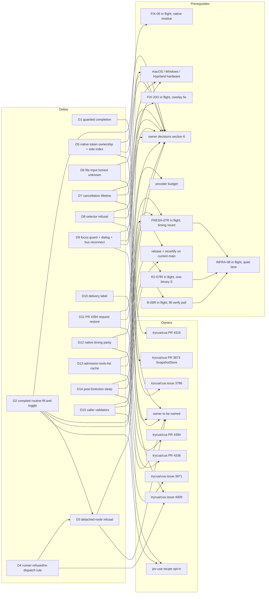

# trycua/cua issue 3963: rewrite draft as deltas against current CUA

**Status: DRAFT, staged on the kvnloo/cua fork only. Nothing here is posted upstream.** A fresh reviewer checks it first (see REVIEW-CHECKLIST.md), then the loop's Publish agent pushes the branch.

- **Base:** upstream main `5de1a3799` (2026-10-03). Every statement is a delta against that tree, not a standalone target architecture.
- **Base drift:** <!-- gen:drift -->upstream main at generation is `a9baa8d10` (git ls-remote, 2026-10-03T21:20:49Z): 46 commits past the base, 77 past the tested 0f1955d2f, 36 past FRESH-07's `9a2b1d99e` and 4 past the STATE pin `5845488f2` (STATE.pins.upstream_main_w7). 2 Linux or core Driver paths changed since the base; none since the STATE pin.<!-- /gen:drift --> Section 8 (Freshness) gives each path its status.
- **Owners:** kvnloo/cua#73 holds the canonical rewrite. kvnloo/cua#93 holds the experiment specs and invariants. kvnloo/cua#10 holds the whole-task accounting. kvnloo/cua#74 holds the posting queue and READY NOW gate.
- **Upstream context:** trycua/cua issue 3963 is closed. The maintainer accepted the direction on 2026-09-29, with four conditions:
  - Delivery is through separate owner PRs, one per mechanism.
  - The promotion rule applies: forced path, observed route, independent oracle, visible failure and fallback.
  - Mechanisms are recipe-local and opt-in by default.
  - The deleted services stay deleted.
- **What this draft is for:** a proposed replacement for the "current-state note" at the top of that issue. It is written for the Publish agent and, later, for whoever posts to the existing owners. It does not ask for a new RFC.
- **This revision (r3):** the wave-7 lanes are folded in from the loop's STATE.json. The generator now refuses to run unless:
  - every STATE disposition key maps to exactly one row, or to a listed exclusion with a reason (coverage gate);
  - the provider budget adds up and its ledger sums match (budget gate);
  - the upstream pin is the newest STATE pin, and live upstream main has been read with `git ls-remote` (pin gate);
  - no row template carries hand-written wave text. Rows that a lane of the wave in flight touches carry a generated PENDING mark from `pending-plan.json` and cite no result of that lane.
- **Claim boundary of this revision:** a staged downstream draft. It reflects STATE as of wave 7, with the wave-8 lanes in flight marked PENDING. It is final for E5 only after a regeneration from the wave-8 STATE and a fresh review.

Machine-checked companions in this directory:

| File | Purpose |
|---|---|
| `rows.spec.json` | hand-maintained row input: STATE locator, claim template, a pointer for every number, coverage exclusions, freshness statuses, cited PR heads |
| `pending-plan.json` | the lanes of the wave in flight and the rows each one touches (planner input) |
| `generate.py` | builds the rows from `rows.spec.json` + `pending-plan.json` + STATE.json + packet files, behind the coverage, budget, pin and wave-text gates (stdlib only) |
| `REGEN-DIFF.md` | generated: every row that changed against the previous draft |
| `dispositions.json` | generated: one record per row of section 4, each number with its pointer |
| `claims.json` | every cited number, with the packet file, SHA and line or JSON path that contain it |
| `dependency-graph.json` | section 9 as data |
| `provenance.json` | input SHAs, the STATE.json, plan and generator hashes, the upstream pin, live heads read with `git ls-remote`, freshness, where each cited SHA can be fetched |
| `verify_artifacts.py` | checks all of the above (stdlib only; fetch-aware) |
| `PENDING.md` | rows that can still move, the lanes in flight and the deferred items |
| `REVIEW-CHECKLIST.md` | the fresh reviewer's list |
| `raw/` | logs: the diagnosis of the r2 draft against the wave-7 STATE, the generator and verifier runs from a clean export, and the negative controls |

Notation rules:
- **Upstream items** are plain text, for example trycua/cua PR 4316 or trycua/cua issue 4009. **Fork items** are written kvnloo/cua#N.
- **Numbers:** each one names its lane, the packet commit, and the source/binary it was measured on. Numbers from different sources or binaries are never added or divided into each other. Every number in section 4 is generated from a packet file or STATE; `claims.json` gives its pointer.

## 1. North-star

### Whole-task verified time T

T runs from task start (the first observation) until an independent oracle confirms the outcome. It includes:
- provider decisions;
- observations;
- actions;
- feedback;
- waits;
- verification reads.

This is the loop's END_CONDITION definition (v1).

The reference tasks are:
- **Browser:** the jev-use fixture's fill→submit, toggle→confirm and modal→act.
- **Native:** the canonical GTK3 fixture's checkbox toggle and text entry.

S is median T_baseline divided by median T_composed. Baseline and composed run on the same source, binary, provider, task and environment, in AB/BA or Williams order.

### Measured composition

Every row has an independent-oracle verdict on every trial.

| Layer / task | Result | Lane @ packet commit | Source / binary | Class |
|---|---|---|---|---|
| Browser live TypeSafe, fill→submit | S 45.11 [42.43, 51.90] (3647.2 ms → 80.9 ms) | R2-10 @ `030f6bdbf` | R = upstream `989cc76ce` + steps; sha256 12b9045a | LIVE_PROVIDER+REAL+BENCHMARK |
| Browser live, toggle→confirm / modal→act | S 5.95 [5.70, 6.25] / 5.73 [5.41, 6.00] | R2-10 @ `030f6bdbf` | R | LIVE_PROVIDER+REAL+BENCHMARK |
| Browser live, toggle compiled replay | provider decision deleted on warm invocations (warm valid 29/29; warm decisions 0, warm provider lines 0); no paired live S (budget) | R2-07e @ `67b99ddc6` | R | LIVE_PROVIDER |
| Browser scripted, toggle compiled replay non-regression | COMP+CR − COMP +0.5 ms [-0.6, +2.2] (40/40 pairs valid, one EXCLUSIVE window); H_T FAIL against the +2.0 ms gate | R2-07g @ `869896d57` | R | REAL+BENCHMARK (FIXTURE) |
| Browser live, modal forced fallback | LF 0/3 verified (pooled with R2-07e 0/4); live modal decision component OWNER_DECISION, conditional on the n7_presat substitution | R2-07g @ `869896d57` | R | LIVE_PROVIDER |
| Browser scripted, fill / toggle / modal | S 45.61 / 47.01 / 46.56 | R2-10 @ `030f6bdbf` | R | REAL+BENCHMARK |
| Browser scripted, recertified | S 45.65 [44.39, 48.36] / 46.82 [45.21, 48.69] / 44.86 [43.56, 46.81] | R2-10R @ `d22eeb2ec` | R' = `45dff8f32` (upstream 0f1955d2f + steps); sha256 922111c5 | REAL+BENCHMARK (FIXTURE) |
| Browser scripted, KEEP-only deletions | S 1.01 in every class | R2-10 @ `030f6bdbf` | R | REAL+BENCHMARK |
| Browser scripted, one-binary untested share | toggle 0.4% (3.6%), modal 0.4% (3.3%), fill 16.9% (19.0%) | B-08 @ `49ae94590` | B7 = R' + B-07 picks; sha256 6f95aef5 | REAL+BENCHMARK (FIXTURE) |
| Native GTK3, best arm (X+V+HCL) | S checkbox 1.196 [1.189, 1.198], text 5.941 [5.938, 5.957] | N-04 @ `9d7d8d7a5` | R'n = `11a03bf51` (R' + marks); sha256 78a1137d | REAL+BENCHMARK (FIXTURE) |
| Native GTK3, KEEP-only (S0) | S checkbox 1.180, text 1.030 | N-04 @ `9d7d8d7a5` | R'n | REAL+BENCHMARK (FIXTURE) |

### What the numbers mean

- **Most of S is owner decisions.**
  - Browser: the awaited cursor glide is 94-97% of default T (R2-10). With KEEP-only deletions, S is 1.01.
  - Native text: the gain is the cursor reveal (N-04). KEEP-only S is 1.030.
- **Provider decisions deleted live:**
  - Fill: guarded completion plus the compiled routine remove both TypeSafe decisions (R2-10: provider decisions 484.8 ms of work per task).
  - Toggle: compiled replay removes the decision on warm invocations (R2-07e). The training invocation still pays it, and no paired live S on one source exists (budget). The quiet non-regression bound is +2.2 ms, not the +2.0 ms gate (R2-07g, REVISE).
  - Modal: the live forced fallback failed every time (R2-07g, pooled with R2-07e 0/4), so under the pre-registered mapping the live modal decision component is OWNER_DECISION. That holds only if the owner accepts the n7_presat substitution. R2-10 measured 90.4% and 90.9% of live composed T as untested on toggle and modal.
- **Native T uses the scripted chooser** in every native packet (N-04). Whether native T may leave out provider decisions is an owner decision (section 6).
- **External references, not gates** (R2-10): PreAct reports 8.5-13x and SkillDroid ~2.4x for warm or pure replay. Both are different benchmarks with different baselines, so they are not compared with these numbers.

### Critical-path status (END_CONDITION E2)

- **Native:** met on the 0f1955d2f line. Untested share 1.19% (checkbox) and 1.65% (text) (N-04). FRESH-07 found these timing rows AFFECTED by upstream overlay.rs and could not recertify them (shared infrastructure). Their recertification, FRESH-07R, is a wave-8 lane in flight (PENDING).
- **Browser scripted, one binary (B-08 on B7):**
  - Toggle and modal are met: untested 0.4% (3.6%) and 0.4% (3.3%), counting below-gate sub-spans as IRREDUCIBLE (as UNTESTED in brackets).
  - Fill is not met: 16.9% (19.0%). Almost all of the remainder is R2-10's `runner` component, the compiled routine's unstamped verify poll. B-09 built the pre-registered run but measured nothing (BLOCKED, shared infrastructure, not terminal); its resume B-09R is a wave-8 lane in flight (PENDING).
  - The per-process cold first-snapshot excess is OWNER_DECISION in every class (B-08, pre-registered). With B-04's per-document IRREDUCIBLE, the cold-snapshot lineage is terminal.
- **Browser live:** fill decisions are deleted (R2-03, R2-10); the toggle decision is deleted on warm compiled replay (R2-07e); the modal decision component is OWNER_DECISION under R2-07g's pre-registered mapping, conditional on the n7_presat substitution. No one-source live share was computed after R2-07e (budget).

## 2. Invariants (kvnloo/cua#73, kvnloo/cua#93)

These override every speed claim. Every composed or fixed arm of every accepted packet cited here held them (E4: 0 violations). The violations that were found sit in unfixed control arms or at the default path of a tested source, and each one led to a KILL or a fix: R2-07 and B-02 N-W2 (detached-node dispatch) led to FIX-01; OWN-36 (cross-session native tokens) led to FIX-02; FIX-03's new cross-session side-index hole on F' led to the 2237cf9c6 fix (F5); FIX-04's closed-window native token, which typed into another session's window on F5 and U', led to F6c.

One regression sits outside the accepted arms: on current upstream main the kvnloo/cua#20 focus guard skips restores, because trycua/cua PR 4529 maps the Driver's own overlay during a guarded action and the guard counts it as a popup (FRESH-07: three RECERT_FAILs). The guard rows hold on the 0f1955d2f line only. The fork fix FIX-20O is a wave-8 lane in flight (PENDING).

1. **No new service.**
   - Prohibited: shadow state, a second verifier, a router or decision service, a lifecycle registry, a batch API, an event service, a routine engine and a route miner.
   - Every surviving delta in section 5 is a refusal, a binding, a bound or a measurement knob inside an existing owner: BrowserStore, SnapshotStore (trycua/cua PR 3873, merged), the Linux focus guard, the jev-use runner, or the MCP admission path.
   - trycua/cua issue 2794 stays the only mechanical-composition owner.
   - The a11y bus name-owner trigger was not built, because it needs a second persistent session-bus connection (OWN-20Q-A2); NoReply + Peer.Ping covers the measured cases.
2. **Instrumentation is env-gated and default-off.**
   - Every Driver knob used here is a `CUA_DRIVER_EXP_*` variable read once per process and off by default.
   - Default-off smokes match the control build in R2-10 Phase 0, R2-10R Phase 0 and N-04.
   - Two exceptions are owner decisions, not packet defects: trycua/cua PR 4336 emits its timing fields unconditionally (log only; OWN-75R), and Driver product telemetry is on by default in sessions.
3. **Events are wake hints, never the oracle.**
   - CDP event wake is slower than polling (R2-02 KILL).
   - Native event wake fires on the acted object's focus change, not on the effect (R2-09 KILL).
   - Event absence authorizes reuse in no scope (OWN-20 census).
4. **Passive state never mints authority.**
   - Native element tokens are bound to the publishing session and to a runtime generation (FIX-02 F1/F2, recertified by RECERT-FIX).
   - With the fix, cross-session and cross-generation tokens are refused. Without it they landed 40/40.
   - The non-authority side index is window-scoped on F5: cross-session effects 40 on F' vs 0 on F5 (FIX-03-SIDE).
   - A still-valid token whose window has closed is refused on F6 (FIX-04 F6c); on F5 and U' it typed into another session's window.
5. **A possibly landed effect stays unknown until reconciled, and is never blindly replayed.**
   - R2-05: 0 duplicates in 60 typed trials with reconcile.
   - OWN-105: runner reconcile.
   - FIX-01 Part B: refused means refused.
   - FIX-02 F3: re-dispatch only after a pre-dispatch refusal.
   - R2-07c G5: withheld effects end unknown, with 0 duplicates.
   - FIX-03 found that F5's post-assignment refusal said delivery unknown while its effect field said refused, although the change landed. On F6 (FIX-04), F6a records such a refusal as effect=unverifiable, and F6b makes the runner reconcile it from the oracle instead of re-dispatching. The generation-0 change still reaches the server: that is IRREDUCIBLE, and it is now receipted as unknown.
6. **Routine identity may persist. Refs, tokens, captures, capabilities and session epochs never become durable authority.**
   - The compiled routine stores logical intent and rebinds fresh refs before every replayed mutation. A detached node is refused and then rebound (R2-07b on FIX-01).
   - Snapshot ids carry a per-process generation (FIX-02 F2).

## 3. Existing owners

Every surviving delta maps onto an owner that already exists. "None named" means no upstream issue or PR owns the exact change yet. The delta then stays a fork candidate until the poster names one; that is not a request for a new owner.

| Delta | Upstream owner (plain text) | Fork owner | Evidence |
|---|---|---|---|
| D1 guarded completion (one fewer provider decision, fill) | trycua/cua PR 4316 (open, head `a0bca7440`) | kvnloo/cua#10 | R2-03, R2-10 |
| D2 compiled fresh-bound routine (fill; toggle) | none named; jev-use recipe, opt-in (maintainer decision on trycua/cua issue 3963) | kvnloo/cua#93 | R2-07b, R2-10, R2-07e, R2-07g |
| D3 Driver refuses dom_event actions on a detached node | none named; Driver browser tools (ref lifecycle) | kvnloo/cua#73, kvnloo/cua#93 | FIX-01, B-02, R2-10 Phase 0 |
| D4 runner: refused is refused; re-dispatch only after a pre-dispatch refusal | trycua/cua issue 4009 (outcome vocabulary) | kvnloo/cua#105 (fork PR, head `98a45e6c5`) | R2-05, OWN-105, FIX-01 Part B, FIX-02 F3, FIX-04 F6b |
| D5 native token session ownership + runtime generation + window-scoped side index | trycua/cua PR 3873 (merged; SnapshotStore owner) | kvnloo/cua#36 | OWN-36, FIX-02, RECERT-FIX, FIX-03-SIDE, FIX-04 F6c |
| D6 browser_set_input_files detached check (honest unknown) | same as D3 | kvnloo/cua#36 | FIX-02-F4, FIX-03, FIX-04 F6a |
| D7 cancel before admission + guard ownership | trycua/cua issue 3796 | kvnloo/cua#9, kvnloo/cua#84 (fork PR, head `566b9c732`) | OWN-09, OWN-09R, RECERT-FIX |
| D8 refuse non-boolean get_window_state selectors | none named; related trycua/cua PR 4164 (merged) | kvnloo/cua#16 | OWN-16, OWN-16W, RECERT-FIX |
| D9 focus-guard final read + same_app_dialog fix + AT-SPI bus reconnect | none named; Linux platform focus guard | kvnloo/cua#20 | OWN-20G, OWN-20P, OWN-20Q, OWN-20Q-DLG, OWN-20Q-A2; FRESH-07 (RECERT_FAIL on current main) |
| D10 foreground delivery label | trycua/cua issue 4009 | kvnloo/cua#38 | BUG-01 A |
| D11 restore form + page + outline in the PR 4394 request | trycua/cua PR 4394 (open, head `039257811`) | kvnloo/cua#78 | OWN-78, OWN-78A, OWN-78L |
| D12 native timing parity | trycua/cua PR 4336 (open, head `8391cf802`) | kvnloo/cua#75 | OWN-75R |
| D13 MCP admission tools-list cache (V) | none named; nearest thread trycua/cua issue 2969 (tools/list cost) | kvnloo/cua#93, kvnloo/cua#10 | B-02, N-03, N-04 |
| D14 delete the 50 ms post-DoAction sleep where the effect is visible at return | trycua/cua issue 3971 / PR 3946 (merged; post-action settle) | kvnloo/cua#93, kvnloo/cua#20 | N-01R, R2-09, N-03 |
| D15 caller-compiled output validators (lazy) | jev-use recipe (caller) | kvnloo/cua#93, kvnloo/cua#10 | B-01, N-02, N-03, N-04 |

Evidence notes that need no delta:
- **BUG-01 B (CDP sessions accumulate):** goes to the trycua/cua PR 4052 (merged) thread as an observation.
- **R2-08 (equivalent HTTP route):** stays a caller-side owner decision.
- **B-08 (per-process cold excess):** an owner decision about process reuse, not a Driver change (section 6).

Owner-map input: the read-only census branch `ed6887c11` (scanner pinned to upstream a959b2a; its edges are mentions, never prerequisites). In a clone without that fork ref the verifier fetches it, or reports exactly which ref is needed.

## 4. Dispositions

- **Source:** `dispositions.json`, generated by `generate.py` from `rows.spec.json` and the loop's STATE.json. verify_artifacts.py checks every row against STATE.json and re-runs the generation with `--state`.
- **Packet links:** the packet path is under the branch named in the row. The SHA is read from STATE: it is the accepted head, which is on origin unless the row says it is held.
- **Disposition values:** KEEP, REVISE, KILL, BLOCKED, PARTIAL and SUPERSEDED.
  - BLOCKED names one blocker class: hardware, owner decision, budget, or shared infrastructure. Shared infrastructure is not terminal.
  - PARTIAL is used once, for FRESH-07: some verdicts are terminal, and the rest are BLOCKED on shared infrastructure.
  - SUPERSEDED rows have no evidence of their own; the superseding row carries the disposition.
  - No row has the disposition PENDING: every wave-7 lane is folded in.
- **Moving rows:** a non-empty "Pending" cell means the row can still move.
  - A "PENDING: wave-8 lane <id>" mark is generated from `pending-plan.json`. It names a lane in flight that touches the row; the row cites no result of that lane.
  - A "DEFERRED: wave-9 ..." mark names a planned later step.
  - Later waves change only the moving rows (PENDING.md). `REGEN-DIFF.md` lists every row that changed against the previous draft.

<!-- dispositions-table:start -->
| ID | Disposition | Class | Branch @ SHA | Packet | Claim boundary | Blocker | Pending |
|---|---|---|---|---|---|---|---|
| R2-01 | KEEP | BENCHMARK+REAL | exp/r2-01-feedback-ab-20261001 @ `2ca82efae` | docs/experiments/r2-01-2026-10-01/ | Causal attribution only: browser click 1541.6 ms with cursor feedback on vs 23.5 ms off, 98.46% inside the awaited glide; turning feedback off is an owner decision, not a KEEP. |  |  |
| R2-02 | KILL | BENCHMARK+REAL | exp/r2-02-cdp-wake-20261001 @ `8e751a75d` | docs/experiments/r2-02-2026-10-01/ | CDP commit-event wake is slower than the 100 ms poll (+42.1 ms); the effect has already landed at tool return, so there is nothing to wake for. |  |  |
| R2-03 | KEEP | LIVE_PROVIDER+REAL+BENCHMARK | exp/r2-03-guarded-live-20261001 @ `6bab214ab` | docs/experiments/r2-03-2026-10-01/ | TypeSafe on trycua/cua PR 4316: provider requests 2 -> 1 in 40/40 pairs, paired -211.849 ms; fill->submit only (guarded completion binds 0 toggle/modal trials in R2-10). |  |  |
| R2-04 | REVISE | REAL | exp/r2-04-atspi-profile-20261001 @ `9bfd43739` | docs/experiments/r2-04-2026-10-01/ | AT-SPI RPC is under 1% of native action time; bulk/cache KILL for a 9-element tree only; the three localized waits get causal verdicts in N-01R. |  |  |
| R2-05 | KEEP | REAL | exp/r2-05-ack-loss-real-20261001 @ `236e37e01` | docs/experiments/r2-05-2026-10-01/ | 0 duplicates in 60 typed trials for a reconciling caller on real MCP stdio; a naive restart duplicated 10/10; the kvnloo/cua#105 runner itself did not reconcile (fixed in OWN-105). |  |  |
| R2-06 | KEEP | REAL | exp/r2-06-trusted-input-20261001 @ `f00b93963` | docs/experiments/r2-06-2026-10-01/ | Trusted-input misses are late effects (+3.6 to +10.1 ms after return): a single read verified 17/30, a bounded re-read 30/30. |  |  |
| R2-07 | KILL | LIVE_PROVIDER+REAL+BENCHMARK | exp/r2-07-compiled-routine-20261002 @ `2d71548b4` | docs/experiments/r2-07-2026-10-02/ | KILL under the binding spec: on a page re-render the Driver accepted a click on the detached node 3/3 (nothing landed, explicit unknown stop). The routine itself is re-qualified as R2-07b on a FIX-01 tree. |  |  |
| R2-07b | KEEP | REAL+UNIT | exp/fix-01-detached-node-refusal-20261002 @ `4a301d32a` | docs/experiments/fix-01-detached-node-refusal-2026-10-02/ | Compiled fresh-bound fill->submit routine re-qualified (detached node refused 20/20, then rebind verified 20/20); eligible only on a source that contains the FIX-01 Part A and Part B commits. |  |  |
| R2-07c | REVISE | REAL (scripted chooser); FIXTURE (G5 seam); LIVE_PROVIDER NOT_RUN | exp/r2-07c-toggle-modal-compiled-a2-20261003 @ `7f46edd16` | docs/experiments/r2-07c-toggle-modal-compiled-2026-10-03/ | Toggle/modal compiled routine is correctness-qualified (refusals refused, 0 duplicates, reconcile before replay); wall-clock non-regression not shown at loadavg 8-32 (closed for toggle by R2-07d, for modal by R2-07e Part Q). |  |  |
| R2-07d | REVISE | REAL+BENCHMARK (FIXTURE); UNIT; LIVE_PROVIDER NOT_RUN | exp/r2-07d-quiet-timing-phase-l-20261003 @ `79f6dd299` | docs/experiments/r2-07d-quiet-timing-phase-l-2026-10-03/ | Quiet window: toggle compiled-minus-composed +0.5 ms PASS; modal +0.6 ms with CI upper +2.4 ms FAIL (limit +2.0); Phase L NOT_RUN here. The second modal look and Phase L are R2-07e. |  |  |
| R2-07e | KEEP | LIVE_PROVIDER (Phase L, TypeSafe); REAL+BENCHMARK (FIXTURE, Part Q); UNIT; paired live S BLOCKED | exp/r2-07e-modal-gate-phase-l-20261003 @ `67b99ddc6` | docs/experiments/r2-07e-modal-gate-phase-l-2026-10-03/ | Toggle: live TypeSafe Phase L deletes the provider decision on warm compiled-replay invocations (warm valid 29/29, warm decisions 0, warm provider lines 0); compiled replay enters the composed toggle configuration. The quiet toggle non-regression bound is R2-07g's row (REVISE); the same-window sanity block here read +0.7 ms [+0.5, +2.6] (no gate). Paired live BASE vs COMP+CR S is not measured (budget). Provider 15 attempts / 15 reached. |  |  |
| R2-07e-MODAL | REVISE | REAL+BENCHMARK (FIXTURE, Part Q); LIVE_PROVIDER (Phase L, n=1 forced fallback) | exp/r2-07e-modal-gate-phase-l-20261003 @ `67b99ddc6` | docs/experiments/r2-07e-modal-gate-phase-l-2026-10-03/ | Modal: modal gate PASS (second, alpha-adjusted look; paired CR-COMP -0.5 ms [-1.4, +0.5], 60/60 pairs valid); live warm valid 29/29 with warm decisions 0, warm provider lines 0, but the forced fallback LF (n7_presat) was not verified (TypeSafe chose reobserve while confirm was offered). Compiled replay stays out of the composed modal configuration; R2-07g pooled the forced fallback and maps the live modal decision component to OWNER_DECISION. |  | Owner ruling on the n7_presat substitution for the spec's rename fallback (see R2-07g-MODAL). |
| R2-07g | REVISE | REAL+BENCHMARK (FIXTURE, scripted, EXCLUSIVE quiet-timed window); LIVE_PROVIDER (toggle LN, one run); REAL+FIXTURE controls; UNIT | exp/r2-07g-live-fallback-ln-20261003 @ `869896d57` | docs/experiments/r2-07g-live-fallback-ln-2026-10-03/ | Toggle compiled replay, quiet non-regression on binary R (40/40 pairs valid, one EXCLUSIVE window): COMP+CR - COMP +0.5 ms [-0.6, +2.2]; H_T FAIL against the R2-07d gate, so the claim is non-inferiority at the measured upper bound, not at the gate. R2-07e's warm deletion stands. Toggle LN (literal rename, live): refused at the failed precondition, 0 completion, no success reported. Provider 16 attempts / 16 reached. |  | PENDING: wave-8 lane R2-07fR (toggle non-regression re-confirmation on B7). No wave-8 result is cited. Also: owner ruling on the toggle bound: accept non-inferiority at the measured upper bound, or require a larger-n quiet re-run against the gate. |
| R2-07g-MODAL | REVISE | LIVE_PROVIDER (TypeSafe, forced fallback LF, three runs) + REAL; E2 mapping pre-registered | exp/r2-07g-live-fallback-ln-20261003 @ `869896d57` | docs/experiments/r2-07g-live-fallback-ln-2026-10-03/ | Live modal forced fallback (n7_presat): LF 0/3 verified, pooled with R2-07e 0/4; TypeSafe chose reobserve while confirm was offered, with no false success and E4 0. Pre-registered E2 mapping (live modal provider-decision component: OWNER_DECISION), conditional on the owner accepting the n7_presat substitution; decisions inside a fallback continuation are IRREDUCIBLE by invariant. Compiled replay stays out of the composed modal configuration. |  | Owner rulings on the n7_presat substitution and on the live modal admission policy. |
| R2-08 | KEEP | REAL (owned fixture)+BENCHMARK+UNIT | exp/r2-08-cross-surface-20261002 @ `afba150d5` | docs/experiments/r2-08-2026-10-02/ | The fixture's existing POST /submit is equivalent to the GUI route 20/20 and 174.4 ms faster than feedback-off GUI; an eligible route only with per-task equivalence and authorization evidence (owner decision, never a default). |  |  |
| R2-09 | KILL | BENCHMARK+REAL+UNIT; controls REAL+FIXTURE | exp/r2-09-native-event-wake-20261002 @ `3539e34ae` | docs/experiments/r2-09-native-event-wake-2026-10-02/ | Native event wake KILL on Chromium AT-SPI background and GTK3 X11 foreground: without the 50 ms sleep the effect was visible at return 40/40; the event is the acted object's focus change, not the effect. WebKitGTK is a separate BLOCKED row. |  |  |
| R2-09-T3 | BLOCKED | BLOCKED | — | — | No WebKitGTK evidence exists; nothing is claimed for WebKit targets. | owner decision: install WebKitGTK MiniBrowser on the host or use the flatpak GNOME runtime | Owner ruling on WebKitGTK. |
| R2-10 | KEEP | LIVE_PROVIDER+REAL+BENCHMARK; REAL+BENCHMARK (FIXTURE) native | exp/r2-10-composition-20261002 @ `030f6bdbf` | docs/experiments/r2-10-composition-2026-10-02/ | One source R in every arm: live TypeSafe S fill 45.11, toggle 5.95, modal 5.73; KEEP-only S 1.01 in every browser class. Most of the browser S is the feedback-glide owner decision. |  | Published branch carries an encoded private-name list; owner privacy ruling on the held replacement (PUB-02 B, still held after PUB-03). Numbers do not move. |
| R2-10R | KEEP | REAL+BENCHMARK (FIXTURE); Phase 0 UNIT+REAL; live layer BLOCKED | exp/r2-10r-recert-a3-20261003 @ `d22eeb2ec` | docs/experiments/r2-10r-recert-2026-10-03/ | R2-10's scripted and native claims hold on R' (upstream 0f1955d2f + R2-10 steps); the live layer stays certified at 989cc76ce only. The scripted and native rows are AFFECTED by upstream overlay.rs and not recertified on current main (FRESH-07). |  | PENDING: wave-8 lane FRESH-07R (scripted and native rows). No wave-8 result is cited. Also: owner privacy ruling on the held PUB-04 candidate: only the cited branch and SHA may change, not the claims or numbers. |
| R2-10-LIVE-RECERT | BLOCKED | BLOCKED | — | — | Live-layer S is certified on 989cc76ce only. | budget: at least 180 TypeSafe requests reaching the provider; 1 remain of the loop cap of 600 | Owner ruling on the provider budget. |
| R2-10-NATIVE-LIVE | BLOCKED | BLOCKED | — | — | Native T uses the scripted chooser in every native packet. | budget (at least 120 more reached) or owner decision on the native T definition (whether native T may exclude provider decisions) | Owner ruling on native T / budget. |
| R2-10-LIVE-CR | BLOCKED | BLOCKED | — | — | Paired live S on one source for toggle/modal is not measured. R2-10 left 90.4% / 90.9% of live composed T untested; R2-07e then deleted the toggle decision on warm invocations and R2-07g mapped the live modal decision to OWNER_DECISION, but no one-source live share was computed. | budget: a paired live BASE vs COMP+CR toggle/modal run needs at least 120 reached; 1 remain | Owner ruling on the provider budget. |
| B-01 | KEEP | REAL+BENCHMARK+UNIT | exp/b-01r-browser-critpath-textfix-20261002 @ `0cd63f786` | docs/experiments/b-01-browser-critpath-2026-10-02/ | Browser decomposition accepted via the B-01R text fix: glide at 2.097 ms/px is 94–97% of default T; fast glide KEEP; the 100 ms insert_text focus settle (H_T) is an owner decision; caller-compiled validators KEEP. |  |  |
| B-02 | KEEP | BENCHMARK+REAL+UNIT+SOURCE | exp/b-02-browser-driver-sites-20261002 @ `b282ff389` | docs/experiments/b-02-browser-driver-sites-2026-10-02/ | Admission tools-list cache (V) DELETED for fill/toggle (modal not material); endpoint re-proof bound check (H_E) is an owner decision; cold first snapshot (H_W) has no knob and is split by B-03/B-04/B-06/B-08. |  |  |
| B-03 | KEEP | BENCHMARK (Part 1); BENCHMARK+REAL (Part 2) | exp/b-03-toggle-cold-snapshot-20261002 @ `b34eef71e` | docs/experiments/b-03-toggle-cold-snapshot-2026-10-02/ | Part 1 KEEP (K5EV decomposed for every class). Part 2 toggle cold snapshot was UNDECIDED and is closed for its per-document part by B-04 and its per-process part by B-08. |  |  |
| B-04 | REVISE | REAL+BENCHMARK; BENCHMARK re-analysis of R2-10 LIVE_PROVIDER raw | exp/b-04-observation-reconcile-a2-20261003 @ `8620ebfa2` | docs/experiments/b-04-observation-reconcile-2026-10-03/ | Per-document cold first-snapshot excess IRREDUCIBLE (not deletable by an in-task wait or prewarm); the per-process part is B-08's (OWNER_DECISION). |  |  |
| B-05 | REVISE | REAL+BENCHMARK (FIXTURE); UNIT | exp/b-05-browser-mcp-transport-a3-20261003 @ `705238282` | docs/experiments/b-05-browser-mcp-transport-2026-10-03/ | Transport in/out is partly phase-trace instrumentation; PARSE_FAST deletes 0.16-0.26 ms and VALIDATE_FAST 0.12-0.15 ms of work per task, both below the 0.5 ms gate, so both are KILL and parse/validate are IRREDUCIBLE. |  |  |
| B-06 | REVISE | REAL+BENCHMARK (FIXTURE); SOURCE | exp/b-06-per-process-cold-snapshot-20261003 @ `31bc98a95` | docs/experiments/b-06-per-process-cold-snapshot-2026-10-03/ | Per-process cold excess UNDECIDED under the pre-registered rule (positive control failed). The post-hoc amended reading (10.0 ms fill, 4.0 ms toggle) is moot: B-08's fresh pre-registered run gives OWNER_DECISION. |  |  |
| B-07 | REVISE | REAL+BENCHMARK (FIXTURE); UNIT (weak); SOURCE | exp/b-07-transport-residual-rprime-20261003 @ `eab1e87a3` | docs/experiments/b-07-transport-residual-rprime-2026-10-03/ | Every browser MCP transport sub-span is terminal; PREP_FAST and POST_FAST are not carried (fill DELETED is fragile, 0.48 ms of work). |  |  |
| B-08 | KEEP | REAL+BENCHMARK (FIXTURE, scripted COMP, EXCLUSIVE quiet-timed); SOURCE (Part E mapping) | exp/b-08-per-process-cold-b7-20261003 @ `49ae94590` | docs/experiments/b-08-per-process-cold-b7-2026-10-03/ | Per-process cold first-snapshot excess is OWNER_DECISION in every class (pre-registered, binary B7, 384 valid trials, E4 0): D = C - Wa fill 10.58 ms [9.50, 11.41], toggle 3.05 ms [2.62, 5.38], modal 4.56 ms [2.98, 5.92]. Terminal for the B-04/B-06 lineage. One-binary untested share (C arm, below-gate as IRREDUCIBLE / UNTESTED): toggle 0.4% / 3.6%, modal 0.4% / 3.3%, fill 16.9% / 19.0%. |  | PENDING: wave-8 lane B-09R (fill untested share only; the per-process verdict is terminal). No wave-8 result is cited. |
| B-09 | BLOCKED | BLOCKED (measured run, shared infrastructure); UNIT (knob red/green); pilot excluded | exp/b-09-fill-verify-poll-b7-20261003 @ `56284782d` | docs/experiments/b-09-fill-verify-poll-b7-2026-10-03/ | Not terminal. The env-gated verify-poll knob, stamps, runner, PREREG, analyzer and verifier are committed on binary B7; the measured run never started, so no verdict, S or share is claimed. Fill's runner (verify poll) component stays UNTESTED at B-08's 16.9% / 19.0%. | shared infrastructure (not terminal): the EXCLUSIVE quiet-lane lock was starved by SHARED holders that another track's processes inherited; resume is one command with the PREREG unchanged | PENDING: wave-8 lane B-09R (measured run). No wave-8 result is cited. |
| R2-07f | BLOCKED | BLOCKED (measured run, shared infrastructure); UNIT; pilot excluded | exp/r2-07f-compiled-replay-b7-decomp-20261003 @ `2c0475522` | docs/experiments/r2-07f-compiled-replay-b7-decomp-2026-10-03/ | Not terminal. PREREG, harness, analyzer and verifier for the one-binary scripted toggle/modal S and decomposition on binary B7 are committed; no measured trial ran, so nothing is claimed for them. | shared infrastructure (not terminal): the EXCLUSIVE quiet-lane lock was wedged by SHARED holders of another track; the committed plan runs unchanged | PENDING: wave-8 lane R2-07fR. No wave-8 result is cited. |
| N-01R | KEEP | BENCHMARK+REAL+UNIT (FIXTURE) | exp/n-01r-native-wait-ab-20261002 @ `3bb4a7fc7` | docs/experiments/n-01r-native-wait-ab-2026-10-02/ | 50 ms post-DoAction sleep DELETED scoped to GTK3 AT-SPI background delivery (extended to Chromium AT-SPI background by R2-09); cursor reveal OWNER_DECISION; focus-guard settle IRREDUCIBLE. |  |  |
| N-02 | KEEP | BENCHMARK+REAL+UNIT; FIXTURE (equivalence) | exp/n-02-native-transport-20261002 @ `9846ac803` | docs/experiments/n-02-native-transport-2026-10-02/ | Caller-compiled output validators DELETED per trial, but eager compilation costs 107.5 ms per session (net negative at one task per session unless lazy); CL settle-overshoot clamp KILL. |  |  |
| N-03 | KEEP | REAL+BENCHMARK (FIXTURE); UNIT | exp/n-03-native-closure-axfg-a3-20261003 @ `6b70ec902` | docs/experiments/n-03-native-closure-axfg-2026-10-03/ | V DELETED; ax_fg S0 DELETED only for GTK3 on X11 ax_fg at the default config; HCL OWNER_DECISION; focus-steal control is a pre-registered FAIL (39/40). AFFECTED by upstream overlay.rs and not recertified on current main (FRESH-07). |  | PENDING: wave-8 lane FRESH-07R. No wave-8 result is cited. Also: published raw output carries session-bus paths; owner privacy ruling on the held PUB-03 candidate. Numbers do not move. |
| N-04 | KEEP | REAL+BENCHMARK (FIXTURE); UNIT | exp/n-04-native-composition-rprime-20261003 @ `9d7d8d7a5` | docs/experiments/n-04-native-composition-rprime-2026-10-03/ | Native composition on one binary R'n with the scripted chooser: best arm S 1.196 checkbox / 5.941 text (KEEP-only 1.180 / 1.030); E2 untested 1.19% / 1.65%. AFFECTED by upstream overlay.rs and not recertified on current main (FRESH-07). |  | PENDING: wave-8 lane FRESH-07R. No wave-8 result is cited. Also: published raw output carries session-bus paths; owner privacy ruling on the held PUB-03 candidate (numbers do not move). |
| FIX-01 | REVISE | REAL+UNIT+BENCHMARK | exp/fix-01-detached-node-refusal-20261002 @ `4a301d32a` | docs/experiments/fix-01-detached-node-refusal-2026-10-02/ | dom_event browser_click/pointer/download refuse detached nodes (browser_ref_stale) 20/20; REVISE only because the cherry-pick onto the B-01/R2-10 source needed a recorded one-hunk resolution. |  |  |
| FIX-02 | KEEP | REAL+FIXTURE; REAL (fault injection); UNIT | exp/fix-02-token-ownership-retry-scope-20261002 @ `cea02cb74` | docs/experiments/fix-02-token-ownership-retry-scope-2026-10-02/ | F1 native tokens bound to the publishing session, F2 runtime generation, F3 runner re-dispatch only after pre-dispatch refusals: KEEP (isolation between distinct sessions, not adversarial isolation); recertified on 0f1955d2f by RECERT-FIX. FIX-03 found a side-index hole on this line, so the kvnloo/cua#36 candidate moves to F5; FIX-04's F6b narrows the runner rule for refusals that declare unknown delivery. |  |  |
| FIX-02-F4 | REVISE | REAL; UNIT | exp/fix-02-token-ownership-retry-scope-20261002 @ `cea02cb74` | docs/experiments/fix-02-token-ownership-retry-scope-2026-10-02/ | browser_set_input_files refuses inputs detached before the call 20/20; a re-render inside the check->set window is not covered (FIX-03: that window is IRREDUCIBLE with an honest unknown). |  |  |
| FIX-03 | REVISE | REAL+FIXTURE (browser A1-A3, seam-forced page); UNIT | exp/fix-03-file-input-toctou-session-routing-20261003 @ `e300edbd3` | docs/experiments/fix-03-toctou-session-routing-2026-10-03/ | F4 IRREDUCIBLE with an honest unknown: F5's post-assignment isConnected check gives 0 of 20 success receipts and 20 of 20 browser_ref_stale refusals with delivery unknown (F'S: 20 of 20 success receipts for a detached input), but 20 of 20 detached change events still reached the server; CDP cannot make check and assign atomic. F5 maps that refusal to effect=refused (pre-existing mapping); FIX-04's F6a maps it to effect=unverifiable. |  |  |
| FIX-03-SIDE | KEEP | REAL (native X11, X RECORD oracle); UNIT; SOURCE (routing reachability) | exp/fix-03-file-input-toctou-session-routing-20261003 @ `e300edbd3` | docs/experiments/fix-03-toctou-session-routing-2026-10-03/ | Side-index window scoping 2237cf9c6 closes a NEW cross-session hole on F' (the FIX-02 candidate): 40 cross-session effects on F' vs 0 on F5; W2dX discriminates (U' landed 20 of 20, F5 refused 20 of 20); the recording-lookup test is KEEP and snapshot_id routing is KEEP with no fix (unreachable). The kvnloo/cua#36 candidate is F5, not F'. |  | PENDING: wave-8 lane FIX-05 (native AT-SPI index fallbacks). No wave-8 result is cited. |
| FIX-04 | KEEP | UNIT; REAL+FIXTURE (browser D); REAL (X11 native, SHARED lock, descriptive timing only); SOURCE | exp/fix-04-unknown-delivery-effect-20261003 @ `2b59a66f7` | docs/experiments/fix-04-unknown-delivery-effect-2026-10-03/ | Fork candidate F6: A, F6a maps refusals that declare unknown delivery to effect=unverifiable (UNIT red, then green); B, F6b makes the runner honour declared delivery and reconcile a possibly-landed completion from the oracle, with no blind re-dispatch; D, on F6 the seam-forced race gives 0/20 success receipts and 20/20 unverifiable receipts with delivery unknown, while the generation-0 change still reaches the server 20/20 (irreducible). Native residue stays open: perform_action, scroll_element, the set_value fallback and the Hyprland/Wayland-inject fall-throughs. |  | PENDING: wave-8 lane FIX-05 (native residue). No wave-8 result is cited. |
| FIX-04-CT | KEEP | REAL+FIXTURE (X11 native, SHARED lock); UNIT; SOURCE | exp/fix-04-unknown-delivery-effect-20261003 @ `2b59a66f7` | docs/experiments/fix-04-unknown-delivery-effect-2026-10-03/ | New E4 finding, closed on F6: a still-valid native token whose window had closed typed into another session's window (F5 20/20, U' 20/20); with F6c it is refused stale_element_token (F6 0/20 cross-window). F6c changes default native type_text/focus behaviour when the addressed element is gone (refuse instead of a pid-wide re-walk); the focus row CF does not discriminate and rests on UNIT. |  | Owner/reviewer ruling on F6c as a change of default native behaviour. |
| RECERT-FIX | KEEP | UNIT + REAL (FIXTURE) + SOURCE | exp/fix-recert-a3-20261003 @ `939580fc6` | docs/experiments/fix-recert-a3-2026-10-03/ | FIX-02 F1-F3, the kvnloo/cua#84 revision (under a disclosed re-run rule) and dd205d17b recertified on 0f1955d2f; new same-process two-window row KEEP; fixed 0 vs unfixed 100/50/20 invariant violations (cross-session / stale / duplicate). |  |  |
| BUG-01 | KEEP | REAL+UNIT | exp/bug-01-delivery-cdp-sessions-20261002 @ `097b4f097` | docs/experiments/bug-01-delivery-cdp-2026-10-02/ | A: foreground trusted click receipts said delivery=background in 20 of 20; fix 2533db6d5+49a3adf0f reports foreground 20/20. B: CDP sessions never detach (accumulation only; no cost shown on a no-op page). |  |  |
| OWN-09 | KILL | UNIT/FIXTURE + SOURCE | exp/own-09-cancel-barrier-rows-20261002 @ `bf07c8fe3` | docs/experiments/own-09-cancel-barrier-rows-2026-10-02/ | kvnloo/cua#84 as-is does not answer kvnloo/cua#9: fails R6 (40/40 per variant) and R1 (1/40). |  |  |
| OWN-09R | KEEP | UNIT/FIXTURE + REAL (R8 stdio) + SOURCE | exp/own-09r-84-revision-20261002 @ `0c2896a53` | docs/experiments/own-09r-84-revision-2026-10-02/ | The revised kvnloo/cua#84 passes every gating Linux row (recertified on 0f1955d2f); its timeout path can block the next action indefinitely (owner decision); R8 notifications/cancelled ignored (owner decision). |  | Owner rulings on the bounded coordinator wait, R8 and the strict unit-row reading can turn this into REVISE before any proposal. |
| OWN-09-R3 | BLOCKED | BLOCKED | — | — | No held-input cleanup evidence. | hardware: macOS target-side drag/mouse-up oracle |  |
| OWN-09-R8 | BLOCKED | BLOCKED | — | — | notifications/cancelled is ignored on both arms (OWN-09R, REAL stdio 40/40 each). | owner decision: implement MCP notifications/cancelled or keep it ignored | Owner ruling on R8. |
| OWN-16 | KEEP | REAL+UNIT | exp/own-16-modality-truth-20261002 @ `7a4f3252a` | docs/experiments/own-16-modality-truth-2026-10-02/ | Linux X11, boolean selectors: the omitted producer never ran (42/42 per mode), confirmed by an independent X RECORD + dbus-monitor oracle. |  |  |
| OWN-16W | KEEP | REAL+UNIT | exp/own-16w-sway-modality-20261002 @ `1b9819157` | docs/experiments/own-16w-sway-modality-2026-10-02/ | Headless sway native Wayland and Xwayland rows KEEP; fix dd205d17b refuses non-boolean selectors (and JSON null) on Linux only. The X11 string row is UNAFFECTED by upstream 9a2b1d99e (FRESH-07). |  | Owner ruling on dd205d17b refusing JSON null. |
| OWN-16-HYPR | BLOCKED | BLOCKED | — | — | No Hyprland evidence. | hardware: a real Omarchy/Hyprland seat (host desktop is off limits; headless sway evidence does not transfer) |  |
| OWN-16-MACWIN | BLOCKED | BLOCKED | — | — | Linux evidence does not stand in for macOS/Windows selector parity. | hardware: macOS and Windows |  |
| OWN-20 | KEEP | REAL (FIXTURE) + SOURCE | exp/own-20-atspi-invalidation-census-20261002 @ `6da15bf35` | docs/experiments/own-20-atspi-invalidation-census-2026-10-02/ | GTK3 AT-SPI census: always observe in every scope; event absence authorizes reuse in no scope (child_add is a noisy hint: no children-changed event in 40 of 40 reps). |  |  |
| OWN-20G | KEEP | UNIT; REAL (FIXTURE); BENCHMARK | exp/own-20g-guard-final-diff-a2-20261003 @ `ce7544cc0` | docs/experiments/own-20g-guard-final-diff-2026-10-03/ | Focus-guard final read on deadline exit: G restored 20/20 + 20/20 steals vs U 20/20 + 20/20 silent misses on a faithful reproduction; CL settle clamp KILL; same-process a11y bus restart safe but not live (closed by OWN-20P A). |  | Published raw output carries the local user name; owner privacy ruling on the held PUB-03 candidate. Numbers do not move. |
| OWN-20P | KEEP | UNIT + REAL (FIXTURE) + SOURCE | exp/own-20p-guard-port-a11y-20261003 @ `64081dded` | docs/experiments/own-20p-guard-port-a11y-2026-10-03/ | Guard port on clean main and a11y bus reconnect are fork candidates; the marked-twin R1 substitution is superseded by OWN-20Q's mark-free R1m. Holds on the 0f1955d2f line; R1 fails recertification on upstream 9a2b1d99e (FRESH-07). |  | PENDING: wave-8 lane FIX-20O (R1 on current main). No wave-8 result is cited. |
| OWN-20Q | KEEP | REAL (FIXTURE, X11 private session, no timing claim) + UNIT | exp/own-20q-a11y-triggers-dialog-markfree-20261003 @ `44116546d` | docs/experiments/own-20q-a11y-triggers-dialog-markfree-2026-10-03/ | R1m, mark-free stall on product binaries: U0 silent miss 40 of 40, G0 verified restore 40 of 40, 0 false restores. Holds on the 0f1955d2f line; R1m fails recertification on upstream 9a2b1d99e (FRESH-07). |  | PENDING: wave-8 lane FIX-20O (R1m on current main). No wave-8 result is cited. |
| OWN-20Q-DLG | KEEP | REAL (FIXTURE, X11 private session) + UNIT | exp/own-20q-a11y-triggers-dialog-markfree-20261003 @ `44116546d` | docs/experiments/own-20q-a11y-triggers-dialog-markfree-2026-10-03/ | same_app_dialog misclassification: GA misclassifies 20 of 20; fix 4ac191a7c restores 20 of 20; the app's own dialog stays focused 10 of 10. Holds on the 0f1955d2f line; it fails recertification on upstream 9a2b1d99e (FRESH-07). |  | PENDING: wave-8 lane FIX-20O (DLG on current main). No wave-8 result is cited. |
| OWN-20Q-A2 | REVISE | REAL (FIXTURE, X11 private session) + UNIT + SOURCE (r3n) | exp/own-20q-a11y-triggers-dialog-markfree-20261003 @ `44116546d` | docs/experiments/own-20q-a11y-triggers-dialog-markfree-2026-10-03/ | The org.a11y.Bus name-owner trigger (r3n) is not implemented (GQ passes 0 of 20). The revised claim, NoReply + Peer.Ping trigger 31318e374, holds r3s 20 of 20 (a stalled click ends effect=unverifiable on both binaries, no mutation), r3w 10 of 10 and r3_carry 23 of 23 real restarts. UNAFFECTED by upstream 9a2b1d99e (FRESH-07). |  | Owner/design ruling on r3n (OWN-20Q-R3N). |
| OWN-20Q-R3N | BLOCKED | BLOCKED | — | — | No name-owner trigger exists; nothing is claimed for r3n. | owner decision: implement the name-owner trigger (it needs a second persistent session-bus connection) or keep NoReply + Peer.Ping | Owner/design ruling on r3n. |
| OWN-20-WAYLAND | BLOCKED | BLOCKED | — | — | Guard, invalidation and OWN-20Q rows are X11/GTK3 only. | hardware: a real Hyprland/Wayland seat |  |
| OWN-36 | REVISE | REAL+FIXTURE; SOURCE (I6 telemetry) | exp/own-36-session-isolation-native-20261002 @ `ff77554f4` | docs/experiments/own-36-session-isolation-native-2026-10-02/ | Capture ownership KEEP; native token ownership was KILL here and is KEEP on the fork candidates (FIX-02, now F5 after FIX-03); I3s shared-window replacement is an owner decision. |  | Owner ruling on I3s shared-window replacement. |
| OWN-36-MACWIN | BLOCKED | BLOCKED | — | — | Browser rows are complete upstream (trycua/cua PR 4317 merged); native rows are Linux only. | hardware: macOS and Windows native ownership rows |  |
| OWN-75 | SUPERSEDED | none accepted | exp/own-75-timing-parity-4336-20261002 @ `cd1878872` | — | Hard-stop record only; no evidence. Never cite it. |  | Do not post this row before the owner privacy ruling. |
| OWN-75R | KEEP | REAL (FIXTURE) + UNIT + SOURCE | exp/own-75r-timing-parity-4336-20261002 @ `e02621fdc` | docs/experiments/own-75-timing-parity-4336-2026-10-02/ | trycua/cua PR 4336 at 8391cf802 is behaviour-identical to its base on 160/160 REAL trials; it emits the new fields unconditionally (owner call). Reproduce from the PKT-01 repair head efe36d1a1. |  | Owner ruling on the unconditional (log-only) timing fields. |
| OWN-78 | REVISE | LIVE_PROVIDER+REAL+FIXTURE+UNIT | exp/own-78-provider-receipts-4394-20261002 @ `5107f3cca` | docs/experiments/own-78-provider-receipts-4394-2026-10-02/ | trycua/cua PR 4394 as is: the backend field matches the HTTP responder 30/30 live, but the PR runner abstains at step 1 in 30/30 trials vs pre-PR 5/5 verified. The fix is candidate F (OWN-78A, OWN-78L). |  |  |
| OWN-78A | REVISE | LIVE_PROVIDER + FIXTURE + UNIT | exp/own-78a-abstain-isolation-4394-20261003 @ `6f6c67955` | docs/experiments/own-78a-abstain-isolation-4394-2026-10-03/ | Abstain needs form + page + outline restored (candidate F 61eec0909: A2 correct-type 5/5 vs PR abstain 5/5); R1-lite was not run here (lane cap) and is closed by OWN-78L. |  |  |
| OWN-78L | KEEP | LIVE_PROVIDER (TypeSafe, n=3) + FIXTURE (MOCK, CAP-0, STUB) + UNIT | exp/own-78l-r1-lite-f-20261003 @ `d9edde70e` | docs/experiments/own-78l-r1-lite-f-2026-10-03/ | kvnloo/cua#78 REVISE -> KEEP on fork fix candidate F 61eec0909: live TypeSafe R1-lite verified 3 of 3, backend == responder 3 of 3, 0 replays or restarts; MOCK and CAP-0 controls pass. KEEP is the pre-registered gate, not a rate (n is small: the true rate may be as low as 0.29 (exact two-sided 95% lower bound)). |  |  |
| OWN-78-S1 | BLOCKED | BLOCKED | — | — | No S1 backend evidence. | owner decision and/or budget: the S1 adapter is not local and only TypeSafe is permitted | Owner ruling on another provider or budget. |
| OWN-78-R1R4 | BLOCKED | BLOCKED | — | — | Live end-to-end evidence for F is R1-lite only (OWN-78L, n = 3). | budget: full-n live R1 20 / R4 20 needs about 60 reached; 1 remain | Owner ruling on the provider budget. |
| OWN-78-A2A3 | BLOCKED | BLOCKED | — | — | F's step-1 margin over abstain stays thin; the residual gap to the pre-PR request is not attributed. | budget: the A2-vs-A3 residual request gap needs further live decisions; 1 remain | Owner ruling on the provider budget. |
| OWN-105 | KEEP | REAL+UNIT | exp/own-105-runner-reconcile-20261002 @ `b97daa4ba` | docs/experiments/own-105-runner-reconcile-2026-10-02/ | Python and TS runner gaps fixed with no new service: 0 duplicate mutations in 148 fixed trials on real MCP stdio; the re-dispatch rule is narrowed further by FIX-02 F3. |  |  |
| OWN-6 | BLOCKED | BLOCKED | — | — | No Windows stale-child evidence. | hardware: Windows host |  |
| OWN-8 | BLOCKED | BLOCKED | — | — | No passive-observation evidence. | hardware (macOS) and owner decision on the passive-observation RFC |  |
| OWN-13 | BLOCKED | BLOCKED | — | — | No macOS slow-read budget evidence. | hardware: macOS |  |
| OWN-19 | BLOCKED | BLOCKED | — | — | No UIA invalidation evidence. | hardware: Windows UIA |  |
| OWN-31 | BLOCKED | BLOCKED | — | — | Linux rows come from this loop's packets only. | hardware: macOS and Windows rows |  |
| OWN-72 | BLOCKED | BLOCKED | — | — | No installed-app scan evidence. | hardware: macOS (list_apps exact-head A/B) |  |
| OWN-94 | BLOCKED | BLOCKED | — | — | Xvfb and headless-sway evidence does not transfer to a real seat. | hardware: a real Omarchy/Hyprland seat |  |
| PKT-01 | KEEP | SOURCE+UNIT | docs/packet-template-audit-a2-20261003 @ `cca59642d` | docs/experiments/packet-audit-2026-10-03/ | Clean-clone audit of 27 published packets; repaired heads for OWN-75R, B-03 and R2-09 (R2-10 repair superseded by PUB-02 B). |  |  |
| PUB-02 | KEEP | SOURCE + UNIT | docs/packet-template-privacy-20261003 @ `c4342323b` | docs/experiments/pub-02-privacy-gate-2026-10-03/ | Privacy gate: R2-10R republished as a3 without the encoded name list; the template scanner decodes hex/base64; two published findings await an owner ruling. |  |  |
| PUB-03 | KEEP | SOURCE (line-level diffs, census) + UNIT (scanner and manifest controls) | exp/own-20g-guard-final-diff-r1c-20261003 @ `cb18ebfbd` | docs/experiments/own-20g-guard-final-diff-2026-10-03/ | Publish-gate fix: three privacy-clean candidates (OWN-20G, cited here; N-03; N-04) differ from the published heads only by redaction, manifest entries and a PRIVACY-REWRITE.md note, and are held for the owner ruling. New published finding: the R2-10R a3 head carries tmp session-bus paths. |  | Owner privacy ruling (replace or keep the published heads). Do not post this row before that ruling. |
| DOC-3963 | KEEP | SOURCE (deliverable) | docs/rfc3963-rewrite-draft-20261003 @ `088fe745a` | docs/rfc/3963-rewrite/ | The wave-6 revision of this draft, superseded by DOC-3963b and by this revision. |  |  |
| DOC-10-74 | KEEP | SOURCE (deliverable) | docs/accounting-10-queue-74-20261003 @ `a3e3cb86e` | docs/rfc/10-final-accounting/ | kvnloo/cua#10 final accounting and kvnloo/cua#74 posting queue staged (wave 6); section 10 defers to it. |  |  |
| FRESH-07 | PARTIAL | SOURCE; UNIT; REAL (private X11, SHARED lock); timing rows BLOCKED (shared infrastructure) | exp/fresh-07-main-9a2b1d99e-20261003 @ `88ec3d5e6` | docs/experiments/fresh-07-main-9a2b1d99e-2026-10-03/ | On upstream main 9a2b1d99e: expectation.rs (trycua/cua PR 4531) and the version bump are UNAFFECTED for every claim. overlay.rs (trycua/cua PR 4529) gives three RECERT_FAILs on kvnloo/cua#20 rows: OWN-20P R1 restores 20/40, OWN-20Q R1m 20/40, OWN-20Q DLG 0/20 restored; the Driver's focus guard counts its own newly mapped overlay as a popup and skips the restore. Controls, no-steal normal paths and the dialog control hold; B-07, B-08, FIX-03, RECERT-FIX and OWN-16W X11 are UNAFFECTED. The timing rows (R2-10R, N-04) and N-03 are AFFECTED and not recertified. | shared infrastructure (not terminal): the timing rows need an EXCLUSIVE quiet-lane window | PENDING: wave-8 lanes FIX-20O (the kvnloo/cua#20 RECERT_FAIL rows), FRESH-07R (packet repair and timing rows). No wave-8 result is cited. Also: the branch is not on the fork: its gzipped raw logs carry the local user name and need redaction before a push. |
| PUB-04 | KEEP | SOURCE + UNIT | exp/r2-10r-recert-a3-r1c-20261003 @ `abec23f30` | docs/experiments/pub-04-r2-10r-a3-privacy-candidate-2026-10-03/ | Fifth privacy candidate, held: the replacement for the published R2-10R a3 head differs from it only by tmp session-bus redactions (25 paths) plus a note; the R2-10R verifier gives 189/189 on the published, redaction-only and candidate heads. The cited SHA is the branch tip; the candidate head is a2ded080c. Replacing a branch limits exposure but does not purge objects already fetchable by SHA. |  | Owner privacy ruling. Do not post this row before that ruling. |
| DOC-3963b | KEEP | SOURCE (deliverable) | docs/rfc3963-rewrite-draft-r2-20261003 @ `e83d9ebc6` | docs/rfc/3963-rewrite/ | The wave-7 revision of this draft: the wave-6 lanes folded in, and the lanes then in flight marked open. This revision regenerates it from the wave-7 STATE with the coverage, budget and pin gates. |  | DEFERRED: wave-9 final regeneration of this draft from the wave-8 STATE, then a fresh review. |
| DOC-10-74b | KEEP | SOURCE (deliverable) | docs/accounting-10-queue-74-r2-20261003 @ `40f1fcd9e` | docs/rfc/10-final-accounting/ | kvnloo/cua#10 accounting and kvnloo/cua#74 posting queue refreshed with wave 6 (staged, not posted); section 10 defers to it. Its queue entries for the work then in flight still read as pending, and its drift pin is behind live upstream main. |  | DEFERRED: wave-9 refresh of the kvnloo/cua#10 accounting and the kvnloo/cua#74 queue from the wave-8 STATE. |
<!-- dispositions-table:end -->

<!-- head-notes:start -->
Rows whose cited head differs from the head in their own STATE row (generated from STATE; the STATE row head is written plain because it may be unpublished):
- **R2-10R** cites exp/r2-10r-recert-a3-20261003 @ `d22eeb2ec` (from STATE.waves[wave=5].branches['PUB-02 A (R2-10R a3)']); its STATE row names exp/r2-10r-recert-a2-20261003 @ c183b95e3. The R2-10R STATE record still names the a2 head, which was never pushed (its raw output carried an encoded private-name list). PUB-02 A republished the same claims and numbers as a3, which is the head on origin and the head cited here. PUB-03 then found tmp session-bus paths in the a3 head; PUB-04 built the held replacement candidate.
- **B-01** cites exp/b-01r-browser-critpath-textfix-20261002 @ `0cd63f786` (from STATE.dispositions.B-01R); its STATE row names exp/b-01-browser-critpath-20261002 (no commit). The B-01 STATE record names the original lane branch without a commit; the decomposition was accepted through the B-01R text-fix lane, whose head is cited.
<!-- head-notes:end -->

<!-- gen:coverage -->
STATE.dispositions keys without a row of their own (rows.spec.json `exclusions`, checked by the coverage gate):
- **N-01:** hard-stop record superseded by N-01R; there is no evidence to cite
- **B-01R:** text-fix lane; its head is the accepted B-01 commit, which row B-01 cites through its head
- **owner_rows_linux:** owner-row summary map; the rows that need it cite it through state_subkey
- **owner_rows_blocked_hardware:** blocked-row map; the rows that need it cite it through state_subkey
- **R2-10_w2_note:** wave-2 note on R2-10 (a string, no disposition of its own); row R2-10 carries the disposition
- **R2-09_w2_note:** wave-2 note on R2-09 (a string, no disposition of its own); row R2-09 carries the disposition
- **OWN-75_w3_note:** wave-3 note on OWN-75 (a string, no disposition of its own); rows OWN-75 and OWN-75R carry the dispositions

STATE records split into several rows, one per verdict (`split_of`): FIX-01 → FIX-01, R2-07b; R2-07e → R2-07e, R2-07e-MODAL; R2-07g → R2-07g, R2-07g-MODAL; FIX-02 → FIX-02, FIX-02-F4; FIX-03 → FIX-03, FIX-03-SIDE; FIX-04 → FIX-04, FIX-04-CT; OWN-20Q → OWN-20Q, OWN-20Q-DLG, OWN-20Q-A2.
<!-- /gen:coverage -->

## 5. Remaining deltas

Each delta has three parts:
- **Minimal upstream change:** the smallest change to an existing owner.
- **Evidence:** which lane at which commit.
- **Gate:** what is still missing (see section 8 for the shared checks).

None is READY NOW for upstream: every one waits on a staged review, an owner decision, a rebase check or a wave-8 lane in flight.

- **D1 guarded completion (fill).**
  - *Change:* trycua/cua PR 4316 as is (opt-in, recipe-local).
  - *Evidence:* R2-03 @ `6bab214ab`: 40/40 pairs at 2 → 1 provider requests, -211.849 ms paired. R2-10 @ `030f6bdbf` composes it in live fill.
  - *Gate:* live-head re-read; the review of trycua/cua PR 4316 itself. No new evidence needed for the structural claim.
- **D2 compiled fresh-bound routine (fill; toggle).**
  - *Change:* a jev-use opt-in that stores logical intent and dependencies, then rebinds fresh refs on every replay. No routine engine.
  - *Evidence:* R2-07b on FIX-01 @ `4a301d32a`; R2-10 fill COMP (all invocations counted, training included); R2-07e @ `67b99ddc6` (live toggle: warm decisions deleted; compiled replay enters the composed toggle configuration); R2-07g @ `869896d57` (quiet toggle non-regression bounded at +2.2 ms, REVISE; live modal forced fallback LF 0/3).
  - *Gate:*
    - needs D3 first;
    - modal stays excluded (R2-07e-MODAL and R2-07g-MODAL REVISE);
    - owner rulings on the toggle bound, on the n7_presat substitution and on live modal admission;
    - the one-binary scripted S on B7 (R2-07fR) and fill's verify poll (B-09R) are wave-8 lanes in flight (PENDING).
- **D3 detached-node refusal.**
  - *Change:* the FIX-01 Part A refusal (`8cfa8c1db`, three files in the Driver browser tools).
  - *Evidence:* FIX-01 @ `4a301d32a`: unfixed accepted 20/20, fixed refused 20/20, then rebind verified 20/20. R2-10 Phase 0 re-ran it on R.
  - *Gate:* the upstream owner is still to be named; a rebase check on current main.
- **D4 runner rule.**
  - *Change:* refused is refused, and re-dispatch only after a pre-dispatch refusal code. These are FIX-01 Part B `6eb9319fe` and FIX-02 F3 `6e9f9dfff`, on top of kvnloo/cua#105.
  - *Evidence:* OWN-105 @ `b97daa4ba`; FIX-02 @ `cea02cb74`; recertified by RECERT-FIX @ `939580fc6`; FIX-04 @ `2b59a66f7` (F6b `bb1e01f7b`: a refusal that declares unknown delivery is never re-dispatched, and a possibly-landed completion is reconciled from the oracle).
  - *Gate:* native refusal codes are not in the pre-dispatch list (they end unknown, which is safe but unmeasured). F6b reconciles completion candidates only; other possibly-landed refusals end unknown without a state read. Public field names wait for the trycua/cua issue 4009 decision.
- **D5 native token ownership and the side index.**
  - *Change:* bind SnapshotStore tokens to the publishing session (F1 `80e625acc`) and to a per-process generation (F2 `3930dd7d0`), scope the non-authority side index to the token's window (`2237cf9c6`), and refuse a token whose window has closed instead of re-walking the process (F6c `802700282`). The kvnloo/cua#36 candidate is F6 (the F5 line plus FIX-04's fixes), not F' `df4f1edf5`.
  - *Evidence:* FIX-02 @ `cea02cb74`; RECERT-FIX @ `939580fc6` (fixed 0 vs unfixed 100 cross-session mutations); FIX-03 @ `e300edbd3` (side index: 40 cross-session effects on F' vs 0 on F5; recording-lookup test KEEP); FIX-04 @ `2b59a66f7` (closed-window token refused on F6).
  - *Gate:*
    - the remaining native residue (perform_action, scroll_element, the set_value fallback): FIX-05, a wave-8 lane in flight (PENDING);
    - owner rulings on F6c and on I3s (section 6).
- **D6 file-input detached check.**
  - *Change:* the post-assignment isConnected check (`b235fabef`). It makes the receipt honest (refused with delivery unknown) but cannot stop the change from landing: CDP cannot make check and assign atomic, so the window is IRREDUCIBLE with an honest unknown.
  - *Evidence:* FIX-02 F4 @ `cea02cb74` (REVISE); FIX-03 @ `e300edbd3` (F4 REVISE, IRREDUCIBLE-with-honest-unknown).
  - *Gate:* F6a (`937ef7cfa`, FIX-04) labels that refusal effect=unverifiable; an owner ruling on F4 as IRREDUCIBLE with an honest unknown.
- **D7 cancellation lifetime.**
  - *Change:* the kvnloo/cua#84 revision `ba611b51a`: cancel before admission; guards owned until the native work exits.
  - *Evidence:* OWN-09R @ `0c2896a53`; RECERT-FIX @ `939580fc6`.
  - *Gate:* owner decisions on the bounded coordinator wait and on R8. R3 is BLOCKED (macOS).
- **D8 selector refusal.**
  - *Change:* `dd205d17b`, which refuses non-boolean selectors before any producer runs. The rebased candidate is `7e31eae59`.
  - *Evidence:* OWN-16W @ `1b9819157`; RECERT-FIX @ `939580fc6`.
  - *Gate:* an owner ruling on refusing JSON null. The X11 string row is UNAFFECTED by upstream `9a2b1d99e` (FRESH-07). macOS/Windows parity is BLOCKED (hardware).
- **D9 focus guard, dialog case and AT-SPI reconnect.**
  - *Change:* G `a761f1f1f` (a final read when the settle watch ends on its deadline), DLG `4ac191a7c` (same_app_dialog misclassification) and A `064d2e4ad` with the NoReply + Peer.Ping trigger `31318e374` (reconnect after the a11y bus restarts).
  - *Evidence:* OWN-20G @ `ce7544cc0`; OWN-20P @ `64081dded`; OWN-20Q @ `44116546d` (R1m mark-free stall on product binaries KEEP; DLG KEEP; A2 REVISE). All on the 0f1955d2f line. FRESH-07 @ `88ec3d5e6`: on upstream `9a2b1d99e`, R1, R1m and DLG fail recertification.
  - *Gate:*
    - the overlay fix on current main: FIX-20O, a wave-8 lane in flight (PENDING);
    - the name-owner trigger r3n (owner/design decision, OWN-20Q-R3N);
    - Hyprland/Wayland rows (BLOCKED, hardware).
- **D10 delivery label.**
  - *Change:* `2533db6d5` + `49a3adf0f` on `097b4f097`.
  - *Evidence:* BUG-01 @ `097b4f097`.
  - *Gate:* Windows, macOS and embedded labels are UNIT only; the trycua/cua issue 4009 decision.
- **D11 PR 4394 request.**
  - *Change:* restore form + page + outline (candidate F `61eec0909`).
  - *Evidence:* OWN-78A @ `6f6c67955` (F correct-type 5/5 vs PR abstain 5/5, five live decisions per arm); OWN-78L @ `d9edde70e` (R1-lite 3 of 3 verified live; kvnloo/cua#78 REVISE → KEEP on F).
  - *Gate:* full-n R1/R4 and the A2-vs-A3 gap (budget); S1 (owner decision).
- **D12 native timing parity.**
  - *Change:* trycua/cua PR 4336 as is.
  - *Evidence:* OWN-75R @ `e02621fdc` (160/160 behaviour-identical).
  - *Gate:* an owner ruling on the unconditional fields.
- **D13 admission tools-list cache.**
  - *Change:* stop re-validating tools/list on every call. Today this is the measurement knob `CUA_DRIVER_EXP_ADMISSION_TOOLS_CACHE=1`, default off.
  - *Evidence:* B-02 @ `b282ff389`; N-04 @ `9d7d8d7a5` (DELETED: 2.94 ms [2.02 ms, 3.46 ms] checkbox, 3.04 ms [2.01 ms, 3.91 ms] text on R'n).
  - *Gate:* a reviewed product change (the knob is measurement-only); an upstream owner to be named; the native timing rows on current main (FRESH-07R, a wave-8 lane in flight, PENDING).
- **D14 post-DoAction sleep.**
  - *Change:* drop the fixed 50 ms sleep where the effect is visible at return. That scope is GTK3 and Chromium AT-SPI background delivery, plus GTK3 X11 ax_fg at the default config. Today this is the measurement knob `CUA_DRIVER_EXP_NATIVE_POST_ACTION_SLEEP_MS=0`.
  - *Evidence:* N-01R @ `3bb4a7fc7`; R2-09 @ `3539e34ae`; N-03 @ `6b70ec902`.
  - *Gate:*
    - WebKitGTK (BLOCKED, owner decision);
    - a product-change review with the trycua/cua issue 3971 owner;
    - no change for foreground and unguarded routes outside that scope;
    - the native timing rows on current main (FRESH-07R, a wave-8 lane in flight, PENDING).
- **D15 caller-compiled validators.**
  - *Change:* jev-use compiles output validators once and lazily, outside T.
  - *Evidence:* B-01 @ `0cd63f786`; N-02 @ `9846ac803`; N-04 @ `9d7d8d7a5`.
  - *Gate:* the lazy-per-session shape is an owner decision (HCL); the native timing rows on current main (FRESH-07R, a wave-8 lane in flight, PENDING).

## 6. Owner decisions, with measured sizes

Each size is quoted from one packet and is never combined with another.

| Decision | Measured size (lane @ commit, source) | What changes if accepted |
|---|---|---|
| Browser feedback glide default | Awaited glide 2.4-3.0 s of work per task (R2-10 @ `030f6bdbf`: awaited glide 3000.5 ms live fill, glide 2406.2 ms live modal; 94-97% of BASE T); S ≈ 45 with it off vs KEEP-only S 1.01 (binary R) | Browser S on the reference tasks |
| H_E endpoint re-proof bound check | ~22 ms per task (R2-10 @ `030f6bdbf`, scripted fill endpoint revalidation 22.4 (28.2%) of COMP T; COMP_E S 59.13 on fill); B-02 @ `b282ff389` endpoint component 42.7 → 10.6 ms (its own binary) | A security-policy bound replaces the full re-proof |
| Native cursor reveal | Text S 5.941 with it vs 1.030 KEEP-only (N-04 @ `9d7d8d7a5`, R'n); reveal glide 1410.6 ms of work | Native text S |
| H_T insert_text focus settle | 100 ms settle (B-01 @ `0cd63f786`); work deleted per fill task: focus settle 101.0 ms (R2-10 @ `030f6bdbf`, binary R) | Fill T |
| HCL lazy validators | k=1 ≈ 0; k=5 82.22 / 73.69 ms per session (N-04 @ `9d7d8d7a5`, R'n) | Depends on expected session shape |
| R2-08 API route | 174.4 ms faster than feedback-off GUI (R2-08 @ `afba150d5`, upstream c4d0c662 + unmodified Driver) | Caller may use an equivalent, authorized non-GUI route per task |
| Browser per-process cold excess (process reuse) | D = C - Wa: fill 10.58 [9.50, 11.41], toggle 3.05 [2.62, 5.38], modal 4.56 [2.98, 5.92] ms (B-08 @ `49ae94590`, B7; pre-registered) | Whether process or session reuse, with the warm-up outside T, is the product shape |
| I3s shared-window replacement retirement | correctness policy, no size (OWN-36 @ `ff77554f4`) | Whether a shared window's tokens retire on replacement |
| OWN-09R bounded wait and R8 | The wedged closure keeps the guards until it exits; with no coordinator timeout the next action can wait indefinitely (OWN-09R @ `0c2896a53`; STATE owner queue). R8: notifications/cancelled ignored | Bound the coordinator wait with a structured refusal; implement or keep ignoring notifications/cancelled |
| a11y bus name-owner trigger (r3n) | not built: it needs a second persistent session-bus connection (OWN-20Q @ `44116546d`) | Build it, or keep NoReply + Peer.Ping |
| trycua/cua PR 4336 fields | log-only fields emitted unconditionally (OWN-75R @ `e02621fdc`) | Accept, or gate them behind an env var |
| dd205d17b null handling | JSON null, formerly the default, is now refused (OWN-16W @ `1b9819157`) | Third-party clients sending null |
| WebKitGTK | NOT_RUN (R2-09 @ `3539e34ae`) | Install WebKitGTK or use the flatpak runtime, or keep BLOCKED |
| Driver telemetry default | on by default in lane sessions (STATE owner queue, wave 5) | Set it off in the shared session wrapper |
| Provider budget | <!-- gen:budget -->599 of 600 reached used, 1 remain (695 attempts)<!-- /gen:budget --> (STATE provider_budget, read at generation time) | Live recertification, the paired live toggle/modal S, native live arms, kvnloo/cua#78 full-n |
| Native T definition | Native arms use the scripted chooser (N-04 @ `9d7d8d7a5`) | Whether native T may exclude provider decisions, or must pay for live arms |
| Live modal admission and the n7_presat substitution | live forced fallback LF 0/3 verified, pooled with R2-07e 0/4 (R2-07g @ `869896d57`, binary R) | Whether a compiled modal routine is admitted although its live fallback continuation fails, which makes the live modal decision component OWNER_DECISION |
| Toggle compiled-replay non-regression bound | +0.5 ms [-0.6, +2.2] against the +2.0 ms gate (R2-07g @ `869896d57`, binary R, 40/40 pairs valid) | Accept non-inferiority at +2.2 ms, or require a larger-n quiet re-run |
| FIX-04 F6c default native behaviour | closed-window token typed across sessions: F6 0/20 cross-window vs F5 20/20 (FIX-04 @ `2b59a66f7`) | Refuse when the addressed element's window is gone, instead of re-walking the process |
| FIX-03 F4 honest unknown | the generation-0 change still reaches the server 20/20 (irreducible) on F6 (FIX-04 @ `2b59a66f7`) | Accept IRREDUCIBLE with an honest unknown as the bound for file inputs over CDP |

Process rulings, which do not move any product claim:
- **Evidence readings:**
  - OWN-09R strict unit-row reading (RECERT-FIX: first run 818 passed / 2 failed, re-run 847/0);
  - OWN-16W analyzer vs PREREG reading.
- **Published-branch findings:** privacy replacements for five published fork branches (PUB-02, PUB-03, PUB-04). The PUB-03, PUB-04 and OWN-75 rows are not posted before that ruling.
- **Incidents:** the wave-4 cross-lane pkill ruling; attribution of the fork heads that appeared on origin before the wave-7 Publish run.

## 7. Non-goals

**Mechanisms KILLed by measurement in this loop:**
- **CDP event wake** (R2-02 @ `8e751a75d`): +42.1 ms slower than polling.
- **Native event wake** (R2-09 @ `3539e34ae`).
- **CL settle-overshoot clamp** (N-02 @ `9846ac803`; OWN-20G @ `ce7544cc0`): its validity was below 100%.
- **PREP_FAST and POST_FAST** (B-07 @ `eab1e87a3`): not carried.
- **PARSE_FAST and VALIDATE_FAST** (B-05 @ `705238282`): below the 0.5 ms gate.
- **AT-SPI bulk/cache** (R2-04, 9-element tree).
- **kvnloo/cua#84 as-is** (OWN-09).
- **The compiled routine under the original spec** (R2-07; superseded by R2-07b).
- **Hiding the cold first snapshot with an in-task wait or prewarm** (B-03/B-04): it makes T slower. For example, the fill 80 ms wait costs +64.0 ms on B-04's binary.

**Rejected or retired designs:**
- The generic "one executable candidate → act without the chooser" rule. It takes the chooser's abstain authority away.
- Guarded completion for toggle/modal. It binds 0 trials.
- A fixed GuardedRun length.
- A universal API-over-GUI preference. R2-08 is per task and an owner decision.
- An atomic check-and-assign for file inputs over CDP (FIX-03): the protocol does not offer one, so the honest unknown is the bound.

**Out of scope by invariant:**
- shadow state;
- a second verifier;
- a router or decision service;
- a lifecycle registry;
- a competing batch API;
- an event service;
- a routine engine or route miner;
- persistent refs, tokens or captures;
- default-on instrumentation.

## 8. Gates

The kvnloo/cua#74 READY NOW check applies to every delta before it is promoted. A delta is READY NOW only when all of the following hold:

1. **Forced path:** the run shows how the intended branch was forced.
2. **Observed route or producer:** marks, receipts or a target-side oracle show which path actually ran.
3. **Independent target-owned outcome:** an oracle that the Driver does not own confirms the effect.
4. **Negative or fallback control:** a control that discriminates (the unfixed arm fails it).
5. **Exact provenance:** each of the following is recorded separately:
   - the live PR head;
   - the tested source;
   - the Driver binary sha256 and version;
   - the fixture, platform and provider;
   - the publication SHA;
   - the CI run.
6. **Bounded claim:** no cross-binary arithmetic; the evidence class is stated per row.
7. **Freshness (E6):** upstream main drift since the tested source touches no `libs/cua-driver` path the claim depends on. Otherwise recertify.
8. **Default-off:** any Driver knob stays env-gated and off; a product default changes only through a reviewed owner PR.
9. **Owner decision recorded:** wherever section 6 applies.
10. **Privacy-clean publication:** every commit of the cited branch passes the privacy scan.

### Freshness

- **Tested source → draft base:** from the tested 0f1955d2f to the draft base `5de1a3799`, upstream changed 15 files under `libs/cua-driver` (provenance.json). 14 are macOS, Windows, e2e or Skills files; the 15th is `tests/fixtures/shared/scenarios.json`. None is a Linux core, sdk or platform-linux path.
- **Base drift:** <!-- gen:drift -->upstream main at generation is `a9baa8d10` (git ls-remote, 2026-10-03T21:20:49Z): 46 commits past the base, 77 past the tested 0f1955d2f, 36 past FRESH-07's `9a2b1d99e` and 4 past the STATE pin `5845488f2` (STATE.pins.upstream_main_w7). 2 Linux or core Driver paths changed since the base; none since the STATE pin.<!-- /gen:drift -->
- **Linux/core paths since the base** (statuses from STATE, FRESH-07):
<!-- gen:freshness -->
| Upstream item | Path | Merged as | Status |
|---|---|---|---|
| trycua/cua PR 4529 (keep idle X11 cursor overlays unmapped) | `libs/cua-driver/rust/crates/platform-linux/src/overlay.rs` | `5e13eb777` | RECERT_FAIL on 9a2b1d99e for OWN-20P R1, OWN-20Q R1m and OWN-20Q DLG (the focus guard counts the Driver's own newly mapped overlay as a popup); timing rows AFFECTED, not recertified (FRESH-07) |
| trycua/cua PR 4531 (verify_state reads label-less display text on macOS) | `libs/cua-driver/rust/crates/cua-driver-core/src/expectation.rs` | `15c6c24e2` | UNAFFECTED for every claim (FRESH-07) |
<!-- /gen:freshness -->
  The other changed `libs/cua-driver` files since the base are macOS, Windows, e2e, docs, installer scripts and release bumps; since the STATE pin only the release bump changed (provenance.json).
- **Rows it moves:** the kvnloo/cua#20 guard rows (OWN-20P, OWN-20Q, OWN-20Q-DLG) hold on the 0f1955d2f line only; the fork fix FIX-20O is a wave-8 lane in flight (PENDING). The timing rows (R2-10R, N-04, N-03) are AFFECTED and not recertified; FRESH-07R is a wave-8 lane in flight (PENDING).

Status today: no delta is READY NOW. Each item waits on an owner decision, a staged review, a rebase check or a wave-8 lane in flight.

## 9. Dependency graph

`dependency-graph.json` holds the graph as data; the mermaid block below is generated from it.

<!-- gen:mermaid -->

<!-- /gen:mermaid -->
Reading the graph:
- D2 depends on D3: the compiled routine is eligible only on a source with the detached-node refusal.
- D4 builds on D3's refusal code.
- The open-lane nodes are lanes of the wave in flight (PENDING), not results. They come from `pending-plan.json`.
- D9 depends on the kvnloo/cua#20 overlay fix (FIX-20O, PENDING), and D5 on the native residue (FIX-05, PENDING).
- The timing resumes (B-09R, R2-07fR and FRESH-07R, all PENDING) depend on the quiet-lane fix (INFRA-08, PENDING).
- Every "owner to be named" edge blocks upstream posting only. Fork staging can go ahead.

## 10. Whole-task accounting summary

The kvnloo/cua#10 final table is the authoritative accounting. A sibling deliverable stages it, so it is not duplicated here. The summary below keeps work deleted separate from wall-clock saved, and quotes one binary per line.

- **Browser, R2-10 @ `030f6bdbf` (binary R, live fill):**
  - Work deleted per task: awaited glide 3000.5 ms, provider decisions 484.8 ms, focus settle 101.0 ms, plus smaller items.
  - Wall-clock saved: 3567.3 ms (median paired).
  - On the scripted layer of the same binary, S is 45.61 with the owner-decision components and 1.01 with KEEP-only deletions (scripted COMP_K). Live fill S is 45.11.
  - PREP_FAST's 0.48 ms is not carried (B-07).
- **Browser, R2-07e @ `67b99ddc6` (binary R, live toggle compiled replay):**
  - Work deleted: the TypeSafe decision on every warm invocation (warm valid 29/29; warm decisions 0, warm provider lines 0). The training invocation keeps it (provider decision 489.1 (84.2%) of 580.5 ms).
  - Wall-clock: the amortized mean over 30 invocations (compile and admission included) is 66.8 ms; with the forced fallback it is 73.0 ms; ratio 1.54 to the warm mean. This is a within-run contrast, not a paired S.
- **Browser, R2-07g @ `869896d57` (binary R, scripted toggle):** no further work is deleted. Compiled replay's quiet non-regression is +0.5 ms [-0.6, +2.2]: non-inferior at +2.2 ms, not at the +2.0 ms gate.
- **Browser, B-08 @ `49ae94590` (binary B7, scripted):** no work is deleted. The per-process cold excess is measured and classed OWNER_DECISION: process reuse would move it outside T, which is a policy choice.
- **Native, N-04 @ `9d7d8d7a5` (R'n), BASE → best:**
  - Wall-clock saved: 54.27 ms [53.04, 55.21] (checkbox) and 1468.03 ms (text).
  - The text figure is almost entirely reveal-glide work: 1410.6 ms, an owner decision.
  - KEEP-only S0 is 1.180 / 1.030.
- **Untested share:** see section 1. On the live layer, the modal provider decision now has a verdict: OWNER_DECISION (R2-07g), conditional on the n7_presat substitution. Browser scripted fill's runner component stays UNTESTED; B-09R is a wave-8 lane in flight (PENDING).

Section 11 (rows that can still move, the wave-8 lanes in flight and the deferred items) is in PENDING.md.

## Verification

From the repository root, under the loop's hostless wrapper:

```
python3 docs/rfc/3963-rewrite/generate.py --state <loop STATE.json> --upstream-live <expected upstream main>
python3 docs/rfc/3963-rewrite/generate.py --state <loop STATE.json> --check
python3 docs/rfc/3963-rewrite/verify_artifacts.py --state <loop STATE.json> --all-commits
```

- **Regeneration:** write mode reads live upstream main and the cited PR heads with `git ls-remote` (read-only) and records them. `--pending-plan <file>` takes the planner's lane list for the next wave. `--check` never touches the network and exits 1 if anything would change.
- **Gates:** the generator exits 2 and writes nothing if the coverage, budget, pin or wave-text gate fails.
- **Clean export:** `git archive` the branch into an empty directory and run the verifier there with `--repo <a clone that holds the objects> --head <branch SHA>`.
- **Privacy names:** the scan reads private names from the file named by `CUA_PRIVACY_NAMES_FILE`. That file is kept outside the repository.
- **Without `--state`:** the STATE comparison, the budget and pin checks and the regeneration check are reported as SKIP.
- **Missing refs:** a cited SHA that is not in the clone is fetched read-only from the fork (or, for upstream SHAs, from upstream) by its recorded ref. With `--no-fetch`, or when the ref is not published, the verifier reports `NEED` with the exact `git fetch` command instead of failing.
- **`--offline`:** skips `git ls-remote` and every fetch.

AI-assisted draft, under the repository owner's direction.
