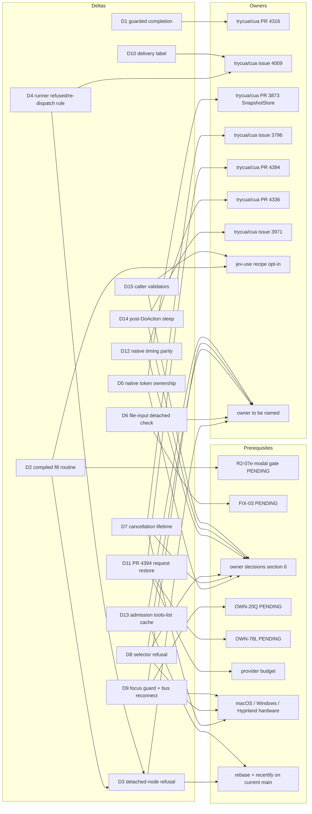

# trycua/cua issue 3963: rewrite draft as deltas against current CUA

**Status: DRAFT, staged on the kvnloo/cua fork only. Nothing here is posted upstream.** A fresh reviewer checks it first (see REVIEW-CHECKLIST.md), then the loop's Publish agent pushes the branch.

- **Base:** upstream main `5de1a3799` (2026-10-03). Every statement is a delta against that tree, not a standalone target architecture.
- **Owners:** kvnloo/cua#73 holds the canonical rewrite. kvnloo/cua#93 holds the experiment specs and invariants. kvnloo/cua#10 holds the whole-task accounting. kvnloo/cua#74 holds the posting queue and READY NOW gate.
- **Upstream context:** trycua/cua issue 3963 is closed. The maintainer accepted the direction on 2026-09-29, with four conditions:
  - Delivery is through separate owner PRs, one per mechanism.
  - The promotion rule applies: forced path, observed route, independent oracle, visible failure and fallback.
  - Mechanisms are recipe-local and opt-in by default.
  - The deleted services stay deleted.
- **What this draft is for:** a proposed replacement for the "current-state note" at the top of that issue. It is written for the Publish agent and, later, for whoever posts to the existing owners. It does not ask for a new RFC.

Machine-checked companions in this directory:

| File | Purpose |
|---|---|
| `dispositions.json` | one record per row of section 4 |
| `claims.json` | every cited number, with the packet and SHA that contain it |
| `dependency-graph.json` | section 9 as data |
| `provenance.json` | input SHAs, the STATE.json hash, gh read times |
| `verify_artifacts.py` | checks all of the above (stdlib only) |
| `PENDING.md` | rows that can still move |
| `REVIEW-CHECKLIST.md` | the fresh reviewer's list |

Notation rules:
- **Upstream items** are plain text, for example trycua/cua PR 4316 or trycua/cua issue 4009. **Fork items** are written kvnloo/cua#N.
- **Numbers:** each one names its lane, the packet commit, and the source/binary it was measured on. Numbers from different sources or binaries are never added or divided into each other.

## 1. North-star

### Whole-task verified time T

T runs from task start (the first observation) until an independent oracle confirms the outcome. It includes:
- provider decisions;
- observations;
- actions;
- feedback;
- waits;
- verification reads.

This is the loop's END_CONDITION definition (v1).

The reference tasks are:
- **Browser:** the jev-use fixture's fill→submit, toggle→confirm and modal→act.
- **Native:** the canonical GTK3 fixture's checkbox toggle and text entry.

S is median T_baseline divided by median T_composed. Baseline and composed run on the same source, binary, provider, task and environment, in AB/BA or Williams order.

### Measured composition

Every row has an independent-oracle verdict on every trial.

| Layer / task | S [95% CI] | Lane @ packet commit | Source / binary | Class |
|---|---|---|---|---|
| Browser live TypeSafe, fill→submit | 45.11 [42.43, 51.90] (3647.2 ms → 80.9 ms) | R2-10 @ `030f6bdbf` | R = upstream `989cc76ce` + steps; sha256 12b9045a | LIVE_PROVIDER+REAL+BENCHMARK |
| Browser live, toggle→confirm / modal→act | 5.95 [5.70, 6.25] / 5.73 [5.41, 6.00] | R2-10 @ `030f6bdbf` | R | LIVE_PROVIDER+REAL+BENCHMARK |
| Browser scripted, fill / toggle / modal | 45.61 / 47.01 / 46.56 | R2-10 @ `030f6bdbf` | R | REAL+BENCHMARK |
| Browser scripted, recertified | 45.65 [44.39, 48.36] / 46.82 [45.21, 48.69] / 44.86 [43.56, 46.81] | R2-10R @ `d22eeb2ec` | R' = `45dff8f32` (upstream `0f1955d2f` + steps); sha256 922111c5 | REAL+BENCHMARK (FIXTURE) |
| Browser scripted, KEEP-only deletions | S 1.01 in every class | R2-10 @ `030f6bdbf` | R | REAL+BENCHMARK |
| Native GTK3, best arm (X+V+HCL) | checkbox 1.196 [1.189, 1.198], text 5.941 [5.938, 5.957] | N-04 @ `9d7d8d7a5` | R'n = `11a03bf51` (R' + marks); sha256 78a1137d | REAL+BENCHMARK (FIXTURE) |
| Native GTK3, KEEP-only (S0) | checkbox 1.180, text 1.030 | N-04 @ `9d7d8d7a5` | R'n | REAL+BENCHMARK (FIXTURE) |

### What the numbers mean

- **Most of S is owner decisions.**
  - Browser: the awaited cursor glide is 94-97% of default T (R2-10). With KEEP-only deletions, S is 1.01.
  - Native text: the gain is the cursor reveal (N-04). KEEP-only S is 1.030.
- **The only provider deletion measured live is on fill.** Guarded completion plus the compiled routine remove both TypeSafe decisions there (R2-10: provider decisions 484.8 ms of work per task).
- **Live toggle and modal** keep both decisions: 90.4% and 90.9% of composed T is untested (R2-10).
- **Native T uses the scripted chooser** in every native packet (N-04). Whether native T may leave out provider decisions is an owner decision (section 6).
- **External references, not gates** (R2-10): PreAct reports 8.5-13x and SkillDroid ~2.4x for warm or pure replay. Both are different benchmarks with different baselines, so they are not compared with these numbers.

### Critical-path status (END_CONDITION E2)

- **Native:** met on one source. Untested share 1.19% (checkbox) and 1.65% (text) (N-04).
- **Browser scripted:**
  - Untested share 1.6% / 0.6% / 0.6% on B-07's binary, if the per-process cold first-snapshot excess is not counted as untested (B-07 @ `eab1e87a3`).
  - B-06's pre-registered result leaves that per-process part UNDECIDED, so on R' the fill and toggle shares are lower bounds of 36.70% and 34.93% (B-06 @ `31bc98a95`).
  - B-08 (wave 6) and an owner ruling can move this (PENDING.md).
- **Browser live toggle/modal:** not met. The untested share is provider decisions, BLOCKED by budget.

## 2. Invariants (kvnloo/cua#73, kvnloo/cua#93)

These override every speed claim. Every composed or fixed arm of every accepted packet cited here held them (E4: 0 violations). The violations that were found sit in unfixed control arms or at the default path of a tested source, and each one led to a KILL or a fix: R2-07 and B-02 N-W2 (detached-node dispatch) led to FIX-01; OWN-36 (cross-session native tokens) led to FIX-02.

1. **No new service.**
   - Prohibited: shadow state, a second verifier, a router or decision service, a lifecycle registry, a batch API, an event service, a routine engine and a route miner.
   - Every surviving delta in section 5 is a refusal, a binding, a bound or a measurement knob inside an existing owner: BrowserStore, SnapshotStore (trycua/cua PR 3873, merged), the Linux focus guard, the jev-use runner, or the MCP admission path.
   - trycua/cua issue 2794 stays the only mechanical-composition owner.
2. **Instrumentation is env-gated and default-off.**
   - Every Driver knob used here is a `CUA_DRIVER_EXP_*` variable read once per process and off by default.
   - Default-off smokes match the control build in R2-10 Phase 0, R2-10R Phase 0 and N-04.
   - Two exceptions are owner decisions, not packet defects: trycua/cua PR 4336 emits its timing fields unconditionally (log only; OWN-75R), and Driver product telemetry is on by default in sessions.
3. **Events are wake hints, never the oracle.**
   - CDP event wake is slower than polling (R2-02 KILL).
   - Native event wake fires on the acted object's focus change, not on the effect (R2-09 KILL).
   - Event absence authorizes reuse in no scope (OWN-20 census).
4. **Passive state never mints authority.**
   - Native element tokens are bound to the publishing session and to a runtime generation (FIX-02 F1/F2, recertified by RECERT-FIX).
   - With the fix, cross-session and cross-generation tokens are refused. Without it they landed 40/40.
5. **A possibly landed effect stays unknown until reconciled, and is never blindly replayed.**
   - R2-05: 0/60 duplicates with reconcile.
   - OWN-105: runner reconcile.
   - FIX-01 Part B: refused means refused.
   - FIX-02 F3: re-dispatch only after a pre-dispatch refusal.
   - R2-07c G5: withheld effects end unknown, with 0 duplicates.
6. **Routine identity may persist. Refs, tokens, captures, capabilities and session epochs never become durable authority.**
   - The compiled routine stores logical intent and rebinds fresh refs before every replayed mutation. A detached node is refused and then rebound (R2-07b on FIX-01).
   - Snapshot ids carry a per-process generation (FIX-02 F2).

## 3. Existing owners

Every surviving delta maps onto an owner that already exists. "None named" means no upstream issue or PR owns the exact change yet. The delta then stays a fork candidate until the poster names one; that is not a request for a new owner.

| Delta | Upstream owner (plain text) | Fork owner | Evidence |
|---|---|---|---|
| D1 guarded completion (one fewer provider decision, fill) | trycua/cua PR 4316 (open, head `a0bca7440`) | kvnloo/cua#10 | R2-03, R2-10 |
| D2 compiled fresh-bound fill routine | none named; jev-use recipe, opt-in (maintainer decision on trycua/cua issue 3963) | kvnloo/cua#93 | R2-07b, R2-10 |
| D3 Driver refuses dom_event actions on a detached node | none named; Driver browser tools (ref lifecycle) | kvnloo/cua#73, kvnloo/cua#93 | FIX-01, B-02, R2-10 Phase 0 |
| D4 runner: refused is refused; re-dispatch only after a pre-dispatch refusal | trycua/cua issue 4009 (outcome vocabulary) | kvnloo/cua#105 (fork PR, head `98a45e6c5`) | R2-05, OWN-105, FIX-01 Part B, FIX-02 F3 |
| D5 native token session ownership + runtime generation | trycua/cua PR 3873 (merged; SnapshotStore owner) | kvnloo/cua#36 | OWN-36, FIX-02, RECERT-FIX |
| D6 browser_set_input_files detached check | same as D3 | kvnloo/cua#36 | FIX-02 F4 (REVISE), FIX-03 pending |
| D7 cancel before admission + guard ownership | trycua/cua issue 3796 | kvnloo/cua#9, kvnloo/cua#84 (fork PR, head `566b9c732`) | OWN-09, OWN-09R, RECERT-FIX |
| D8 refuse non-boolean get_window_state selectors | none named; related trycua/cua PR 4164 (merged) | kvnloo/cua#16 | OWN-16, OWN-16W, RECERT-FIX |
| D9 focus-guard final read on deadline exit + AT-SPI bus reconnect | none named; Linux platform focus guard | kvnloo/cua#20 | OWN-20G, OWN-20P |
| D10 foreground delivery label | trycua/cua issue 4009 | kvnloo/cua#38 | BUG-01 A |
| D11 restore form + page + outline in the PR 4394 request | trycua/cua PR 4394 (open, head `039257811`) | kvnloo/cua#78 | OWN-78, OWN-78A |
| D12 native timing parity | trycua/cua PR 4336 (open, head `8391cf802`) | kvnloo/cua#75 | OWN-75R |
| D13 MCP admission tools-list cache (V) | none named; nearest thread trycua/cua issue 2969 (tools/list cost) | kvnloo/cua#93, kvnloo/cua#10 | B-02, N-03, N-04 |
| D14 delete the 50 ms post-DoAction sleep where the effect is visible at return | trycua/cua issue 3971 / PR 3946 (merged; post-action settle) | kvnloo/cua#93, kvnloo/cua#20 | N-01R, R2-09, N-03 |
| D15 caller-compiled output validators (lazy) | jev-use recipe (caller) | kvnloo/cua#93, kvnloo/cua#10 | B-01, N-02, N-03, N-04 |

Evidence notes that need no delta:
- **BUG-01 B (CDP sessions accumulate):** goes to the trycua/cua PR 4052 (merged) thread as an observation.
- **R2-08 (equivalent HTTP route):** stays a caller-side owner decision.

Owner-map input: the read-only census branch `ed6887c11` (scanner pinned to upstream a959b2a; its edges are mentions, never prerequisites).

## 4. Dispositions

- **Source:** `dispositions.json`. verify_artifacts.py checks every row against the loop's STATE.json and lists each difference with its reason.
- **Packet links:** the packet path is under the branch named in the row, and the SHA is the accepted head on origin.
- **Disposition values:**
  - PENDING: a wave-6 lane that is not accepted.
  - SUPERSEDED: no evidence of its own; the superseding row carries the disposition.
- **Moving rows:** a non-empty "Pending" cell means the row can still move. Later waves change only those rows (PENDING.md).

<!-- dispositions-table:start -->
| ID | Disposition | Class | Branch @ SHA | Packet | Claim boundary | Blocker | Pending |
|---|---|---|---|---|---|---|---|
| R2-01 | KEEP | BENCHMARK+REAL | exp/r2-01-feedback-ab-20261001 @ `2ca82efae` | docs/experiments/r2-01-2026-10-01/ | Causal attribution only: browser click 1541.6 ms with cursor feedback on vs 23.5 ms off, 98.46% inside the awaited glide; turning feedback off is an owner decision, not a KEEP. |  |  |
| R2-02 | KILL | BENCHMARK+REAL | exp/r2-02-cdp-wake-20261001 @ `8e751a75d` | docs/experiments/r2-02-2026-10-01/ | CDP commit-event wake is slower than the 100 ms poll (+42.1 ms); the effect has already landed at tool return, so there is nothing to wake for. |  |  |
| R2-03 | KEEP | LIVE_PROVIDER+REAL+BENCHMARK | exp/r2-03-guarded-live-20261001 @ `6bab214ab` | docs/experiments/r2-03-2026-10-01/ | TypeSafe on trycua/cua PR 4316: provider requests 2 -> 1 in 40/40 pairs, paired -211.849 ms; fill->submit only (guarded completion binds 0 toggle/modal trials in R2-10). |  |  |
| R2-04 | REVISE | REAL | exp/r2-04-atspi-profile-20261001 @ `9bfd43739` | docs/experiments/r2-04-2026-10-01/ | AT-SPI RPC is under 1% of native action time; bulk/cache KILL for a 9-element tree only; the three localized waits get causal verdicts in N-01R. |  |  |
| R2-05 | KEEP | REAL | exp/r2-05-ack-loss-real-20261001 @ `236e37e01` | docs/experiments/r2-05-2026-10-01/ | 0/60 duplicates for a reconciling caller on real MCP stdio; a naive restart duplicated 10/10; the kvnloo/cua#105 runner itself did not reconcile (fixed in OWN-105). |  |  |
| R2-06 | KEEP | REAL | exp/r2-06-trusted-input-20261001 @ `f00b93963` | docs/experiments/r2-06-2026-10-01/ | Trusted-input misses are late effects (+3.6 to +10.1 ms after return): a single read verified 17/30, a bounded re-read 30/30. |  |  |
| R2-07 | KILL | LIVE_PROVIDER+REAL+BENCHMARK | exp/r2-07-compiled-routine-20261002 @ `2d71548b4` | docs/experiments/r2-07-2026-10-02/ | KILL under the binding spec: on a page re-render the Driver accepted a click on the detached node 3/3 (nothing landed, explicit unknown stop). The routine itself is re-qualified as R2-07b on a FIX-01 tree. |  |  |
| R2-07b | KEEP | REAL+UNIT | exp/fix-01-detached-node-refusal-20261002 @ `4a301d32a` | docs/experiments/fix-01-detached-node-refusal-2026-10-02/ | Compiled fresh-bound fill->submit routine re-qualified (detached node refused 20/20, then rebind verified 20/20); eligible only on a source that contains the FIX-01 Part A and Part B commits. |  |  |
| R2-07c | REVISE | REAL (scripted chooser); FIXTURE (G5 seam); LIVE_PROVIDER NOT_RUN | exp/r2-07c-toggle-modal-compiled-a2-20261003 @ `7f46edd16` | docs/experiments/r2-07c-toggle-modal-compiled-2026-10-03/ | Toggle/modal compiled routine is correctness-qualified (refusals refused, 0 duplicates, reconcile before replay); wall-clock non-regression not shown at loadavg 8-32. |  |  |
| R2-07d | REVISE | REAL+BENCHMARK (FIXTURE); UNIT; LIVE_PROVIDER NOT_RUN | exp/r2-07d-quiet-timing-phase-l-20261003 @ `79f6dd299` | docs/experiments/r2-07d-quiet-timing-phase-l-2026-10-03/ | Quiet window: toggle compiled-minus-composed +0.5 ms PASS; modal +0.6 ms with CI upper +2.4 ms FAIL (limit +2.0); Phase L NOT_RUN; the routine is excluded from the composed toggle/modal configuration. |  | R2-07e (wave 6) re-tests the modal gate and may run Phase L; only this row and R2-07e may move. |
| R2-07e | PENDING | NOT_RUN | exp/r2-07e-modal-gate-phase-l-20261003 (not accepted) | — | No claim until a fresh verifier accepts the packet. |  | Wave-6 lane (modal timing gate, then Phase L within its cap). Not accepted; no evidence cited. |
| R2-08 | KEEP | REAL (owned fixture)+BENCHMARK+UNIT | exp/r2-08-cross-surface-20261002 @ `afba150d5` | docs/experiments/r2-08-2026-10-02/ | The fixture's existing POST /submit is equivalent to the GUI route 20/20 and 174.4 ms faster than feedback-off GUI; an eligible route only with per-task equivalence and authorization evidence (owner decision, never a default). |  |  |
| R2-09 | KILL | BENCHMARK+REAL+UNIT; controls REAL+FIXTURE | exp/r2-09-native-event-wake-20261002 @ `3539e34ae` | docs/experiments/r2-09-native-event-wake-2026-10-02/ | Native event wake KILL on Chromium AT-SPI background and GTK3 X11 foreground: without the 50 ms sleep the effect was visible at return 40/40; the event is the acted object's focus change, not the effect. WebKitGTK is a separate BLOCKED row. |  |  |
| R2-09-T3 | BLOCKED | BLOCKED | — | — | No WebKitGTK evidence exists; nothing is claimed for WebKit targets. | owner decision: install WebKitGTK MiniBrowser on the host or use the flatpak GNOME runtime | Owner ruling on WebKitGTK. |
| R2-10 | KEEP | LIVE_PROVIDER+REAL+BENCHMARK; REAL+BENCHMARK (FIXTURE) native | exp/r2-10-composition-20261002 @ `030f6bdbf` | docs/experiments/r2-10-composition-2026-10-02/ | One source R in every arm: live TypeSafe S fill 45.11, toggle 5.95, modal 5.73; KEEP-only S 1.01 in every browser class. Most of the browser S is the feedback-glide owner decision. |  | Published branch carries an encoded private-name list; owner ruling on replacing it with the held r1c candidate (PUB-02 B, PUB-03). Numbers do not move. |
| R2-10R | KEEP | REAL+BENCHMARK (FIXTURE); Phase 0 UNIT+REAL; live layer BLOCKED | exp/r2-10r-recert-a3-20261003 @ `d22eeb2ec` | docs/experiments/r2-10r-recert-2026-10-03/ | R2-10's scripted and native claims hold on R' (upstream 0f1955d2f + R2-10 steps); live layer stays certified at 989cc76ce only. |  |  |
| R2-10-LIVE-RECERT | BLOCKED | BLOCKED | — | — | Live-layer S is certified on 989cc76ce only. | budget: at least 180 TypeSafe requests reaching the provider; 38 remain of the loop cap of 600 | Owner ruling on the provider budget. |
| R2-10-NATIVE-LIVE | BLOCKED | BLOCKED | — | — | Native T uses the scripted chooser in every native packet. | budget (at least 120 more reached) or owner decision on the native T definition (whether native T may exclude provider decisions) | Owner ruling on native T / budget. |
| R2-10-LIVE-CR | BLOCKED | BLOCKED | — | — | Live toggle/modal provider decisions (about 88-89% of live composed T) stay UNTESTED. | budget: a 30-pair live BASE vs COMP+compiled-routine toggle/modal run needs at least 60-120 reached; also needs a passing modal gate (R2-07e) | R2-07e and the budget ruling. |
| B-01 | KEEP | REAL+BENCHMARK+UNIT | exp/b-01r-browser-critpath-textfix-20261002 @ `0cd63f786` | docs/experiments/b-01-browser-critpath-2026-10-02/ | Browser decomposition accepted via the B-01R text fix: glide at 2.097 ms/px is 94-97% of default T; fast glide KEEP; the 100 ms insert_text focus settle (H_T) is an owner decision; caller-compiled validators KEEP. |  |  |
| B-02 | KEEP | BENCHMARK+REAL+UNIT+SOURCE | exp/b-02-browser-driver-sites-20261002 @ `b282ff389` | docs/experiments/b-02-browser-driver-sites-2026-10-02/ | Admission tools-list cache (V) DELETED for fill/toggle (modal not material); endpoint re-proof bound check (H_E) is an owner decision; cold first snapshot (H_W) has no knob and is split by B-03/B-04/B-06. |  |  |
| B-03 | KEEP | BENCHMARK (Part 1); BENCHMARK+REAL (Part 2) | exp/b-03-toggle-cold-snapshot-20261002 @ `b34eef71e` | docs/experiments/b-03-toggle-cold-snapshot-2026-10-02/ | Part 1 KEEP (K5EV decomposed for every class). Part 2 toggle cold snapshot was UNDECIDED and is closed for its per-document part by B-04. |  |  |
| B-04 | REVISE | REAL+BENCHMARK; BENCHMARK re-analysis of R2-10 LIVE_PROVIDER raw | exp/b-04-observation-reconcile-a2-20261003 @ `8620ebfa2` | docs/experiments/b-04-observation-reconcile-2026-10-03/ | Per-document cold first-snapshot excess IRREDUCIBLE (not deletable by an in-task wait or prewarm); per-process part UNDECIDED; R2-10 browser untested shares become lower bounds. |  |  |
| B-05 | REVISE | REAL+BENCHMARK (FIXTURE); UNIT | exp/b-05-browser-mcp-transport-a3-20261003 @ `705238282` | docs/experiments/b-05-browser-mcp-transport-2026-10-03/ | Transport in/out is partly phase-trace instrumentation; PARSE_FAST and VALIDATE_FAST delete 0.1-0.3 ms (below the 0.5 ms gate) and are KILL, so parse/validate are IRREDUCIBLE. |  |  |
| B-06 | REVISE | REAL+BENCHMARK (FIXTURE); SOURCE | exp/b-06-per-process-cold-snapshot-20261003 @ `31bc98a95` | docs/experiments/b-06-per-process-cold-snapshot-2026-10-03/ | Per-process cold excess UNDECIDED under the pre-registered rule (positive control failed); the amended reading (10.0 ms fill, 4.0 ms toggle, OWNER_DECISION) is the owner's call. |  | B-08 (wave 6) and the owner ruling on the post-hoc amendment reading can move the per-process verdict and the browser fill/toggle E2 shares. |
| B-07 | REVISE | REAL+BENCHMARK (FIXTURE); UNIT (weak); SOURCE | exp/b-07-transport-residual-rprime-20261003 @ `eab1e87a3` | docs/experiments/b-07-transport-residual-rprime-2026-10-03/ | Every browser MCP transport sub-span is terminal; PREP_FAST and POST_FAST are not carried (fill DELETED is fragile, 0.48 ms of work). |  |  |
| B-08 | PENDING | NOT_RUN | exp/b-08-per-process-cold-b7-20261003 (not accepted) | — | No claim until a fresh verifier accepts the packet. |  | Wave-6 lane on the browser per-process cold first-snapshot part. Not accepted; no evidence cited. |
| N-01R | KEEP | BENCHMARK+REAL+UNIT (FIXTURE) | exp/n-01r-native-wait-ab-20261002 @ `3bb4a7fc7` | docs/experiments/n-01r-native-wait-ab-2026-10-02/ | 50 ms post-DoAction sleep DELETED scoped to GTK3 AT-SPI background delivery (extended to Chromium AT-SPI background by R2-09); cursor reveal OWNER_DECISION; focus-guard settle IRREDUCIBLE. |  |  |
| N-02 | KEEP | BENCHMARK+REAL+UNIT; FIXTURE (equivalence) | exp/n-02-native-transport-20261002 @ `9846ac803` | docs/experiments/n-02-native-transport-2026-10-02/ | Caller-compiled output validators DELETED per trial, but eager compilation costs 107.5 ms per session (net negative at one task per session unless lazy); CL settle-overshoot clamp KILL. |  |  |
| N-03 | KEEP | REAL+BENCHMARK (FIXTURE); UNIT | exp/n-03-native-closure-axfg-a3-20261003 @ `6b70ec902` | docs/experiments/n-03-native-closure-axfg-2026-10-03/ | V DELETED; ax_fg S0 DELETED only for GTK3 on X11 ax_fg at the default config; HCL OWNER_DECISION; focus-steal control is a pre-registered FAIL (39/40). |  |  |
| N-04 | KEEP | REAL+BENCHMARK (FIXTURE); UNIT | exp/n-04-native-composition-rprime-20261003 @ `9d7d8d7a5` | docs/experiments/n-04-native-composition-rprime-2026-10-03/ | Native composition on one binary R'n with the scripted chooser: best arm S 1.196 checkbox / 5.941 text (KEEP-only 1.180 / 1.030); E2 untested 1.19% / 1.65%. |  |  |
| FIX-01 | REVISE | REAL+UNIT+BENCHMARK | exp/fix-01-detached-node-refusal-20261002 @ `4a301d32a` | docs/experiments/fix-01-detached-node-refusal-2026-10-02/ | dom_event browser_click/pointer/download refuse detached nodes (browser_ref_stale) 20/20; REVISE only because the cherry-pick onto the B-01/R2-10 source needed a recorded one-hunk resolution. |  |  |
| FIX-02 | KEEP | REAL+FIXTURE; REAL (fault injection); UNIT | exp/fix-02-token-ownership-retry-scope-20261002 @ `cea02cb74` | docs/experiments/fix-02-token-ownership-retry-scope-2026-10-02/ | F1 native tokens bound to the publishing session, F2 runtime generation, F3 runner re-dispatch only after pre-dispatch refusals: KEEP (isolation between distinct sessions, not adversarial isolation); recertified on 0f1955d2f by RECERT-FIX. |  |  |
| FIX-02-F4 | REVISE | REAL; UNIT | exp/fix-02-token-ownership-retry-scope-20261002 @ `cea02cb74` | docs/experiments/fix-02-token-ownership-retry-scope-2026-10-02/ | browser_set_input_files refuses inputs detached before the call 20/20; a re-render inside the check->set window is not covered. |  | FIX-03 (wave 6) targets the TOCTOU window and session routing; may move this row. |
| FIX-03 | PENDING | NOT_RUN | exp/fix-03-file-input-toctou-session-routing-20261003 (not accepted) | — | No claim until a fresh verifier accepts the packet. |  | Wave-6 lane (file-input TOCTOU + session routing). Not accepted; no evidence cited. |
| RECERT-FIX | KEEP | UNIT + REAL (FIXTURE) + SOURCE | exp/fix-recert-a3-20261003 @ `939580fc6` | docs/experiments/fix-recert-a3-2026-10-03/ | FIX-02 F1-F3, the kvnloo/cua#84 revision (under a disclosed re-run rule) and dd205d17b recertified on 0f1955d2f; new same-process two-window row KEEP; fixed 0 vs unfixed 100/50/20 invariant violations. |  |  |
| BUG-01 | KEEP | REAL+UNIT | exp/bug-01-delivery-cdp-sessions-20261002 @ `097b4f097` | docs/experiments/bug-01-delivery-cdp-2026-10-02/ | A: foreground trusted click receipts said delivery=background 20/20; fix 2533db6d5+49a3adf0f reports foreground 20/20. B: CDP sessions never detach (accumulation only; no cost shown on a no-op page). |  |  |
| OWN-09 | KILL | UNIT/FIXTURE + SOURCE | exp/own-09-cancel-barrier-rows-20261002 @ `bf07c8fe3` | docs/experiments/own-09-cancel-barrier-rows-2026-10-02/ | kvnloo/cua#84 as-is does not answer kvnloo/cua#9: fails R6 40/40 and R1 1/40. |  |  |
| OWN-09R | KEEP | UNIT/FIXTURE + REAL (R8 stdio) + SOURCE | exp/own-09r-84-revision-20261002 @ `0c2896a53` | docs/experiments/own-09r-84-revision-2026-10-02/ | The revised kvnloo/cua#84 passes every gating Linux row (recertified on 0f1955d2f); its timeout path can block the next action indefinitely (owner decision); R8 notifications/cancelled ignored (owner decision). |  | Owner rulings on the bounded coordinator wait, R8 and the strict unit-row reading can turn this into REVISE before any proposal. |
| OWN-09-R3 | BLOCKED | BLOCKED | — | — | No held-input cleanup evidence. | hardware: macOS target-side drag/mouse-up oracle |  |
| OWN-09-R8 | BLOCKED | BLOCKED | — | — | notifications/cancelled is ignored on both arms (REAL stdio 40/40). | owner decision: implement MCP notifications/cancelled or keep it ignored | Owner ruling on R8. |
| OWN-16 | KEEP | REAL+UNIT | exp/own-16-modality-truth-20261002 @ `7a4f3252a` | docs/experiments/own-16-modality-truth-2026-10-02/ | Linux X11, boolean selectors: the omitted producer never ran (42/42 per mode), confirmed by an independent X RECORD + dbus-monitor oracle. |  |  |
| OWN-16W | KEEP | REAL+UNIT | exp/own-16w-sway-modality-20261002 @ `1b9819157` | docs/experiments/own-16w-sway-modality-2026-10-02/ | Headless sway native Wayland and Xwayland rows KEEP; fix dd205d17b refuses non-boolean selectors (and JSON null) on Linux only. |  | Owner ruling on dd205d17b refusing JSON null. |
| OWN-16-HYPR | BLOCKED | BLOCKED | — | — | No Hyprland evidence. | hardware: a real Omarchy/Hyprland seat (host desktop is off limits; headless sway evidence does not transfer) |  |
| OWN-16-MACWIN | BLOCKED | BLOCKED | — | — | Linux evidence does not stand in for macOS/Windows selector parity. | hardware: macOS and Windows |  |
| OWN-20 | KEEP | REAL (FIXTURE) + SOURCE | exp/own-20-atspi-invalidation-census-20261002 @ `6da15bf35` | docs/experiments/own-20-atspi-invalidation-census-2026-10-02/ | GTK3 AT-SPI census: always observe in every scope; event absence authorizes reuse in no scope (child_add is a noisy hint, missed 40/40). |  |  |
| OWN-20G | KEEP | UNIT; REAL (FIXTURE); BENCHMARK | exp/own-20g-guard-final-diff-a2-20261003 @ `ce7544cc0` | docs/experiments/own-20g-guard-final-diff-2026-10-03/ | Focus-guard final read on deadline exit restores 40/40 vs 40/40 silent misses on a faithful reproduction; CL settle clamp KILL; same-process a11y bus restart safe but not live (closed by OWN-20P A). |  | Published raw output carries the local user name; owner ruling / PUB-03 replacement. Numbers do not move. |
| OWN-20P | KEEP | UNIT + REAL (FIXTURE) + SOURCE | exp/own-20p-guard-port-a11y-20261003 @ `64081dded` | docs/experiments/own-20p-guard-port-a11y-2026-10-03/ | Guard port on clean main and a11y bus reconnect are fork candidates; the R1 restore was shown on measurement-marked twins, the product build on the normal path only. |  | OWN-20Q (wave 6) on reconnect triggers, the same_app_dialog case and a mark-free stall; owner ruling on the marked-twin R1 substitution. |
| OWN-20Q | PENDING | NOT_RUN | exp/own-20q-a11y-triggers-dialog-markfree-20261003 (not accepted) | — | No claim until a fresh verifier accepts the packet. |  | Wave-6 lane (reconnect triggers, same_app_dialog, mark-free stall). Not accepted; no evidence cited. |
| OWN-20-WAYLAND | BLOCKED | BLOCKED | — | — | Guard and invalidation rows are X11/GTK3 only. | hardware: a real Hyprland/Wayland seat |  |
| OWN-36 | REVISE | REAL+FIXTURE; SOURCE (I6 telemetry) | exp/own-36-session-isolation-native-20261002 @ `ff77554f4` | docs/experiments/own-36-session-isolation-native-2026-10-02/ | Capture ownership KEEP; native token ownership was KILL here and is KEEP on the FIX-02 fork candidates; I3s shared-window replacement is an owner decision. |  | Owner ruling on I3s shared-window replacement. |
| OWN-36-MACWIN | BLOCKED | BLOCKED | — | — | Browser rows are complete upstream (trycua/cua PR 4317 merged); native rows are Linux only. | hardware: macOS and Windows native ownership rows |  |
| OWN-75 | SUPERSEDED | none accepted | exp/own-75-timing-parity-4336-20261002 @ `cd1878872` | — | Hard-stop record only; no evidence. Never cite it. |  |  |
| OWN-75R | KEEP | REAL (FIXTURE) + UNIT + SOURCE | exp/own-75r-timing-parity-4336-20261002 @ `e02621fdc` | docs/experiments/own-75-timing-parity-4336-2026-10-02/ | trycua/cua PR 4336 at 8391cf802 is behaviour-identical to its base on 160/160 REAL trials; it emits the new fields unconditionally (owner call). Reproduce from the PKT-01 repair head efe36d1a1. |  | Owner ruling on the unconditional (log-only) timing fields. |
| OWN-78 | REVISE | LIVE_PROVIDER+REAL+FIXTURE+UNIT | exp/own-78-provider-receipts-4394-20261002 @ `5107f3cca` | docs/experiments/own-78-provider-receipts-4394-2026-10-02/ | Backend field matches the HTTP responder 30/30 live; the PR runner abstains at step 1 30/30 vs pre-PR 5/5 verified (cause isolated in OWN-78A). |  |  |
| OWN-78A | REVISE | LIVE_PROVIDER + FIXTURE + UNIT | exp/own-78a-abstain-isolation-4394-20261003 @ `6f6c67955` | docs/experiments/own-78a-abstain-isolation-4394-2026-10-03/ | Abstain needs form + page + outline restored (candidate F 61eec0909: 5/5 vs PR 0/5); F's margin over abstain is thin; R1/R4 full-n and S1 BLOCKED. |  | OWN-78L (wave 6) runs R1-lite on candidate F; may move this row. |
| OWN-78L | PENDING | NOT_RUN | exp/own-78l-r1-lite-f-20261003 (not accepted) | — | No claim until a fresh verifier accepts the packet. |  | Wave-6 lane (R1-lite on candidate F, at most 6 reached). Not accepted; no evidence cited. |
| OWN-78-S1 | BLOCKED | BLOCKED | — | — | No S1 backend evidence. | owner decision and/or budget: the S1 adapter is not local and only TypeSafe is permitted | Owner ruling on another provider or budget. |
| OWN-78-R1R4 | BLOCKED | BLOCKED | — | — | Only step-1 isolation (5 decisions per arm) is measured live. | budget: full-n live R1 20 / R4 20 needs about 60 reached | Budget ruling. |
| OWN-105 | KEEP | REAL+UNIT | exp/own-105-runner-reconcile-20261002 @ `b97daa4ba` | docs/experiments/own-105-runner-reconcile-2026-10-02/ | Python and TS runner gaps fixed with no new service: 0 duplicate mutations in 148 fixed trials on real MCP stdio; the re-dispatch rule is narrowed further by FIX-02 F3. |  |  |
| OWN-6 | BLOCKED | BLOCKED | — | — | No Windows stale-child evidence. | hardware: Windows host |  |
| OWN-8 | BLOCKED | BLOCKED | — | — | No passive-observation evidence. | hardware (macOS) and owner decision on the passive-observation RFC |  |
| OWN-13 | BLOCKED | BLOCKED | — | — | No macOS slow-read budget evidence. | hardware: macOS |  |
| OWN-19 | BLOCKED | BLOCKED | — | — | No UIA invalidation evidence. | hardware: Windows UIA |  |
| OWN-31 | BLOCKED | BLOCKED | — | — | Linux rows come from this loop's packets only. | hardware: macOS and Windows rows |  |
| OWN-72 | BLOCKED | BLOCKED | — | — | No installed-app scan evidence. | hardware: macOS (list_apps exact-head A/B) |  |
| OWN-94 | BLOCKED | BLOCKED | — | — | Xvfb and headless-sway evidence does not transfer to a real seat. | hardware: a real Omarchy/Hyprland seat |  |
| PKT-01 | KEEP | SOURCE+UNIT | docs/packet-template-audit-a2-20261003 @ `cca59642d` | docs/experiments/packet-audit-2026-10-03/ | Clean-clone audit of 27 published packets; repaired heads for OWN-75R, B-03 and R2-09 (R2-10 repair superseded by PUB-02 B). |  |  |
| PUB-02 | KEEP | SOURCE + UNIT | docs/packet-template-privacy-20261003 @ `c4342323b` | docs/experiments/pub-02-privacy-gate-2026-10-03/ | Privacy gate: R2-10R republished clean; the template scanner decodes hex/base64; two published findings await an owner ruling. |  |  |
| PUB-03 | PENDING | NOT_RUN | — | — | No claim until accepted; dispositions do not depend on it. |  | Wave-6 publish-hygiene lane (replacement candidates for published branches with private-class findings). Not accepted; no evidence cited. |
<!-- dispositions-table:end -->

Two STATE records are not separate rows:
- **N-01:** a hard-stop record superseded by N-01R; there is no evidence to cite.
- **B-01R:** the text-fix lane whose head is the accepted B-01 commit.

The verifier lists both as covered.

## 5. Remaining deltas

Each delta has three parts:
- **Minimal upstream change:** the smallest change to an existing owner.
- **Evidence:** which lane at which commit.
- **Gate:** what is still missing (see section 8 for the shared checks).

None is READY NOW for upstream: every one waits on a staged review, an owner decision or a rebase check.

- **D1 guarded completion (fill).**
  - *Change:* trycua/cua PR 4316 as is (opt-in, recipe-local).
  - *Evidence:* R2-03 @ `6bab214ab`: 40/40 pairs at 2 → 1 provider requests, -211.849 ms paired. R2-10 @ `030f6bdbf` composes it in live fill.
  - *Gate:* live-head re-read; the review of trycua/cua PR 4316 itself. No new evidence needed for the structural claim.
- **D2 compiled fresh-bound fill routine.**
  - *Change:* a jev-use opt-in that stores logical intent and dependencies, then rebinds fresh refs on every replay. No routine engine.
  - *Evidence:* R2-07b on FIX-01 @ `4a301d32a`; R2-10 fill COMP (all invocations counted, training included).
  - *Gate:* needs D3 first. Toggle/modal stay excluded until R2-07e passes (PENDING).
- **D3 detached-node refusal.**
  - *Change:* the FIX-01 Part A refusal (`8cfa8c1db`, three files in the Driver browser tools).
  - *Evidence:* FIX-01 @ `4a301d32a`: unfixed accepted 20/20, fixed refused 20/20, then rebind verified 20/20. R2-10 Phase 0 re-ran it on R.
  - *Gate:* the upstream owner is still to be named; a rebase check on current main.
- **D4 runner rule.**
  - *Change:* refused is refused, and re-dispatch only after a pre-dispatch refusal code. These are FIX-01 Part B `6eb9319fe` and FIX-02 F3 `6e9f9dfff`, on top of kvnloo/cua#105.
  - *Evidence:* OWN-105 @ `b97daa4ba`; FIX-02 @ `cea02cb74`; recertified by RECERT-FIX @ `939580fc6`.
  - *Gate:* native refusal codes are not in the pre-dispatch list (they end unknown, which is safe but unmeasured). Public field names wait for the trycua/cua issue 4009 decision.
- **D5 native token ownership.**
  - *Change:* bind SnapshotStore tokens to the publishing session (F1 `80e625acc`) and to a per-process generation (F2 `3930dd7d0`). The rebased candidate is `df4f1edf5`.
  - *Evidence:* FIX-02 @ `cea02cb74`; RECERT-FIX @ `939580fc6` (fixed 0 vs unfixed 100 cross-session mutations).
  - *Gate:*
    - a dedicated recording-lookup test;
    - session checks for the non-authority side index;
    - an owner ruling on I3s (section 6).
- **D6 file-input detached check.**
  - *Change:* move the check inside the DOM.setFileInputFiles call path.
  - *Evidence:* FIX-02 F4 @ `cea02cb74` (REVISE).
  - *Gate:* FIX-03 (PENDING).
- **D7 cancellation lifetime.**
  - *Change:* the kvnloo/cua#84 revision `ba611b51a`: cancel before admission; guards owned until the native work exits.
  - *Evidence:* OWN-09R @ `0c2896a53`; RECERT-FIX @ `939580fc6`.
  - *Gate:* owner decisions on the bounded coordinator wait and on R8. R3 is BLOCKED (macOS).
- **D8 selector refusal.**
  - *Change:* `dd205d17b`, which refuses non-boolean selectors before any producer runs. The rebased candidate is `7e31eae59`.
  - *Evidence:* OWN-16W @ `1b9819157`; RECERT-FIX @ `939580fc6`.
  - *Gate:* an owner ruling on refusing JSON null. macOS/Windows parity is BLOCKED (hardware).
- **D9 focus guard and AT-SPI reconnect.**
  - *Change:* G `a761f1f1f` (a final read when the settle watch ends on its deadline) and A `064d2e4ad` (reconnect after the a11y bus restarts).
  - *Evidence:* OWN-20G @ `ce7544cc0`; OWN-20P @ `64081dded`.
  - *Gate:*
    - R1 on a product binary (OWN-20Q, PENDING);
    - A's NoReply and name-owner triggers;
    - the owner's acceptance of the marked-twin row.
- **D10 delivery label.**
  - *Change:* `2533db6d5` + `49a3adf0f` on `097b4f097`.
  - *Evidence:* BUG-01 @ `097b4f097`.
  - *Gate:* Windows, macOS and embedded labels are UNIT only; the trycua/cua issue 4009 decision.
- **D11 PR 4394 request.**
  - *Change:* restore form + page + outline (candidate F `61eec0909`).
  - *Evidence:* OWN-78A @ `6f6c67955` (F 5/5 vs PR 0/5, five live decisions per arm).
  - *Gate:* OWN-78L R1-lite (PENDING); full-n R1/R4 (budget); S1 (owner decision).
- **D12 native timing parity.**
  - *Change:* trycua/cua PR 4336 as is.
  - *Evidence:* OWN-75R @ `e02621fdc` (160/160 behaviour-identical).
  - *Gate:* an owner ruling on the unconditional fields.
- **D13 admission tools-list cache.**
  - *Change:* stop re-validating tools/list on every call. Today this is the measurement knob `CUA_DRIVER_EXP_ADMISSION_TOOLS_CACHE=1`, default off.
  - *Evidence:* B-02 @ `b282ff389`; N-04 @ `9d7d8d7a5` (DELETED: 2.94 ms [2.02 ms, 3.46 ms] checkbox, 3.04 ms [2.01 ms, 3.91 ms] text on R'n).
  - *Gate:* a reviewed product change (the knob is measurement-only); an upstream owner to be named.
- **D14 post-DoAction sleep.**
  - *Change:* drop the fixed 50 ms sleep where the effect is visible at return. That scope is GTK3 and Chromium AT-SPI background delivery, plus GTK3 X11 ax_fg at the default config. Today this is the measurement knob `CUA_DRIVER_EXP_NATIVE_POST_ACTION_SLEEP_MS=0`.
  - *Evidence:* N-01R @ `3bb4a7fc7`; R2-09 @ `3539e34ae`; N-03 @ `6b70ec902`.
  - *Gate:*
    - WebKitGTK (BLOCKED, owner decision);
    - a product-change review with the trycua/cua issue 3971 owner;
    - no change for foreground and unguarded routes outside that scope.
- **D15 caller-compiled validators.**
  - *Change:* jev-use compiles output validators once and lazily, outside T.
  - *Evidence:* B-01 @ `0cd63f786`; N-02 @ `9846ac803`; N-04 @ `9d7d8d7a5`.
  - *Gate:* the lazy-per-session shape is an owner decision (HCL).

## 6. Owner decisions, with measured sizes

Each size is quoted from one packet and is never combined with another.

| Decision | Measured size (lane @ commit, source) | What changes if accepted |
|---|---|---|
| Browser feedback glide default | Awaited glide 2.4-3.0 s of work per task (R2-10 @ `030f6bdbf`: awaited glide 3000.5 ms live fill, glide 2406.2 ms live modal; 94-97% of BASE T); S ≈ 45 with it off vs KEEP-only S 1.01 (binary R) | Browser S on the reference tasks |
| H_E endpoint re-proof bound check | ~22 ms per task (R2-10 @ `030f6bdbf`, scripted fill endpoint revalidation 22.4 (28.2%) of COMP T; COMP_E S 59.13 on fill); B-02 @ `b282ff389` endpoint component 42.7 → 10.6 ms (its own binary) | A security-policy bound replaces the full re-proof |
| Native cursor reveal | Text S 5.941 with it vs 1.030 KEEP-only (N-04 @ `9d7d8d7a5`, R'n); reveal glide 1410.6 ms of work | Native text S |
| H_T insert_text focus settle | 100 ms settle (B-01 @ `0cd63f786`); work deleted per fill task: focus settle 101.0 ms (R2-10 @ `030f6bdbf`, binary R) | Fill T |
| HCL lazy validators | k=1 ≈ 0; k=5 82.22 / 73.69 ms per session (N-04 @ `9d7d8d7a5`, R'n) | Depends on expected session shape |
| R2-08 API route | 174.4 ms faster than feedback-off GUI (R2-08 @ `afba150d5`, upstream c4d0c662 + unmodified Driver) | Caller may use an equivalent, authorized non-GUI route per task |
| Per-process reuse (B-06 amended reading; B-08 PENDING) | 10.0 [8.0, 12.0] ms fill, 4.0 [3.9, 6.0] ms toggle (B-06 @ `31bc98a95`, R'; post-hoc amendment) | Browser fill/toggle E2 (36.70 / 34.93% lower bounds otherwise) |
| I3s shared-window replacement retirement | correctness policy, no size (OWN-36 @ `ff77554f4`) | Whether a shared window's tokens retire on replacement |
| OWN-09R bounded wait and R8 | The wedged closure keeps the guards until it exits; with no coordinator timeout the next action can wait indefinitely (OWN-09R @ `0c2896a53`; STATE owner queue). R8: notifications/cancelled ignored | Bound the coordinator wait with a structured refusal; implement or keep ignoring notifications/cancelled |
| trycua/cua PR 4336 fields | log-only fields emitted unconditionally (OWN-75R @ `e02621fdc`) | Accept, or gate them behind an env var |
| dd205d17b null handling | JSON null, formerly the default, is now refused (OWN-16W @ `1b9819157`) | Third-party clients sending null |
| WebKitGTK | NOT_RUN (R2-09 @ `3539e34ae`) | Install WebKitGTK or use the flatpak runtime, or keep BLOCKED |
| Driver telemetry default | on by default in lane sessions (STATE owner queue, wave 5) | Set it off in the shared session wrapper |
| Provider budget | 562 of 600 reached used, 38 remain (STATE provider_budget) | Live recertification and live toggle/modal rows |
| Native T definition | Native arms use the scripted chooser (N-04 @ `9d7d8d7a5`) | Whether native T may exclude provider decisions, or must pay for live arms |

Process rulings, which do not move any product claim:
- **Evidence readings:**
  - OWN-09R strict unit-row reading (RECERT-FIX: first run 818 passed / 2 failed, re-run 847/0);
  - OWN-20P marked-twin R1 substitution;
  - OWN-16W analyzer vs PREREG reading.
- **Published-branch findings:** two private-class findings on published fork branches (PUB-02).
- **Incident:** the wave-4 cross-lane pkill ruling.

## 7. Non-goals

**Mechanisms KILLed by measurement in this loop:**
- **CDP event wake** (R2-02 @ `8e751a75d`): +42.1 ms slower than polling.
- **Native event wake** (R2-09 @ `3539e34ae`).
- **CL settle-overshoot clamp** (N-02 @ `9846ac803`; OWN-20G @ `ce7544cc0`): its validity was below 100%.
- **PREP_FAST and POST_FAST** (B-07 @ `eab1e87a3`): not carried.
- **PARSE_FAST and VALIDATE_FAST** (B-05 @ `705238282`): below the 0.5 ms gate.
- **AT-SPI bulk/cache** (R2-04, 9-element tree).
- **kvnloo/cua#84 as-is** (OWN-09).
- **The compiled routine under the original spec** (R2-07; superseded by R2-07b).
- **Hiding the cold first snapshot with an in-task wait or prewarm** (B-03/B-04): it makes T slower. For example, the fill 80 ms wait costs +64.0 ms on B-04's binary.

**Rejected or retired designs:**
- The generic "one executable candidate → act without the chooser" rule. It takes the chooser's abstain authority away.
- Guarded completion for toggle/modal. It binds 0 trials.
- A fixed GuardedRun length.
- A universal API-over-GUI preference. R2-08 is per task and an owner decision.

**Out of scope by invariant:**
- shadow state;
- a second verifier;
- a router or decision service;
- a lifecycle registry;
- a competing batch API;
- an event service;
- a routine engine or route miner;
- persistent refs, tokens or captures;
- default-on instrumentation.

## 8. Gates

The kvnloo/cua#74 READY NOW check applies to every delta before it is promoted. A delta is READY NOW only when all of the following hold:

1. **Forced path:** the run shows how the intended branch was forced.
2. **Observed route or producer:** marks, receipts or a target-side oracle show which path actually ran.
3. **Independent target-owned outcome:** an oracle that the Driver does not own confirms the effect.
4. **Negative or fallback control:** a control that discriminates (the unfixed arm fails it).
5. **Exact provenance:** each of the following is recorded separately:
   - the live PR head;
   - the tested source;
   - the Driver binary sha256 and version;
   - the fixture, platform and provider;
   - the publication SHA;
   - the CI run.
6. **Bounded claim:** no cross-binary arithmetic; the evidence class is stated per row.
7. **Freshness (E6):** upstream main drift since the tested source touches no `libs/cua-driver` path the claim depends on. Otherwise recertify.
8. **Default-off:** any Driver knob stays env-gated and off; a product default changes only through a reviewed owner PR.
9. **Owner decision recorded:** wherever section 6 applies.
10. **Privacy-clean publication:** every commit of the cited branch passes the privacy scan.

Freshness for this draft:
- **Range:** from the tested 0f1955d2f to this base `5de1a3799`, upstream changed 15 files under `libs/cua-driver` (provenance.json).
  - 14 are macOS, Windows, e2e or Skills files.
  - The 15th is `tests/fixtures/shared/scenarios.json`.
  - None is a Linux core, sdk or platform-linux path. The surviving Linux claims are therefore unaffected, as the wave-5 synthesis already concluded.
- **Since the base:** upstream main has moved two more commits (a release bump plus Windows input). provenance.json records the gh read.

Status today: no delta is READY NOW. This matches the kvnloo/cua#74 wave-5 queue: each item waits on an owner decision, a staged review, a rebase check or a PENDING lane.

## 9. Dependency graph

`dependency-graph.json` holds the same graph as data.



Reading the graph:
- D2 depends on D3: the compiled routine is eligible only on a source with the detached-node refusal.
- D4 builds on D3's refusal code.
- Every "owner to be named" edge blocks upstream posting only. Fork staging can go ahead.

## 10. Whole-task accounting summary

The kvnloo/cua#10 final table is the authoritative accounting. A sibling wave-6 lane stages it, so it is not duplicated here. The summary below keeps work deleted separate from wall-clock saved, and quotes one binary per line.

- **Browser, R2-10 @ `030f6bdbf` (binary R, live fill):**
  - Work deleted per task: awaited glide 3000.5 ms, provider decisions 484.8 ms, focus settle 101.0 ms, plus smaller items.
  - Wall-clock saved: 3567.3 ms (median paired).
  - On the scripted layer of the same binary, S is 45.61 with the owner-decision components and 1.01 with KEEP-only deletions (scripted COMP_K). Live fill S is 45.11.
  - Wave 5 deleted no further browser work. PREP_FAST's 0.48 ms is not carried (B-07).
- **Native, N-04 @ `9d7d8d7a5` (R'n), BASE → best:**
  - Wall-clock saved: 54.27 ms [53.04, 55.21] (checkbox) and 1468.03 ms (text).
  - The text figure is almost entirely reveal-glide work: 1410.6 ms, an owner decision.
  - KEEP-only S0 is 1.180 / 1.030.
- **Untested share:** see section 1. Live toggle/modal provider decisions remain the largest untested component (BLOCKED, budget).

Section 11 (rows that can still move) is in PENDING.md.

## Verification

From the repository root, under the loop's hostless wrapper:

```
python3 docs/rfc/3963-rewrite/verify_artifacts.py --state <path to loop STATE.json> --all-commits
```

- **Privacy names:** the scan reads private names from the file named by `CUA_PRIVACY_NAMES_FILE`. That file is kept outside the repository.
- **Without `--state`:** the STATE comparison is reported as SKIP.
- **`--offline`:** skips the `git ls-remote` origin check.

AI-assisted draft, under the repository owner's direction.
