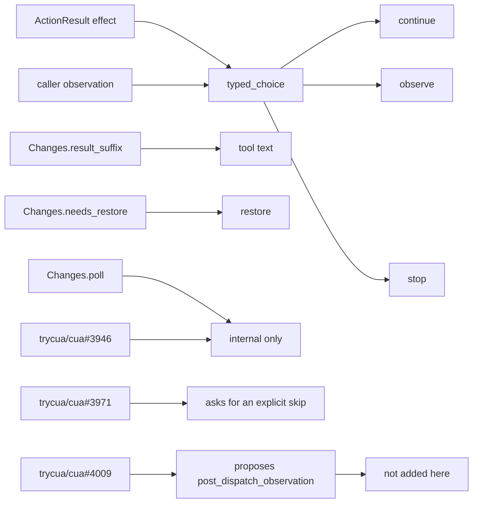

# Issue 55

No new public field is added on this branch. This issue stays open.

The edges in `scripts/repro/handoff/issue-55-edges.tsv` are decided by `action_consumer.typed_choice`. That function does not take `PollProvenance`.

| Consumer | Signal it already has | What the fetched text says | Field added here |
| --- | --- | --- | --- |
| `typed_choice` | `effect`, `observation`, `passive_success` | A confirmed completed observation continues. A skipped or unavailable observation observes. A refusal stops. | none |
| `Changes.result_suffix` | existing method | Tool text. | none |
| `Changes.needs_restore` | existing method | Restore decision. | none |
| `Changes.poll` | private `poll: PollProvenance` | trycua/cua#3946: "Non-goals: public per-call inputs (the RFC's call), defaults, Linux X11." The same issue says a skipped or lost poll returns `Changes::not_polled()` instead of `Changes::no_change()`, and "no wire marker is added". | none |
| trycua/cua#3971 | independent application-state observer | "Skipped or inconclusive observation should be explicit, not reported as verified." The fetched body does not contain a regression that fails without a new field. | none |
| trycua/cua#4009 | proposal only | It proposes `post_dispatch_observation` as `completed`, `skipped`, or `unavailable`, and says that field does not promote `effect`. "Per-call `detect_window_change` input" is "Dropped per #3971". | none |

Smallest surface: no public field.

Promotion dependency: none on this branch, because no field is added. trycua/cua#4009 remains the upstream proposal. This issue stays open.
